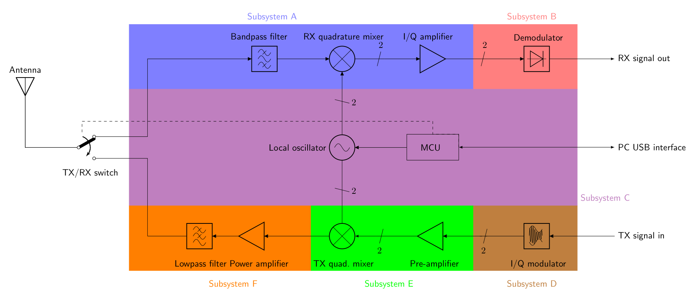
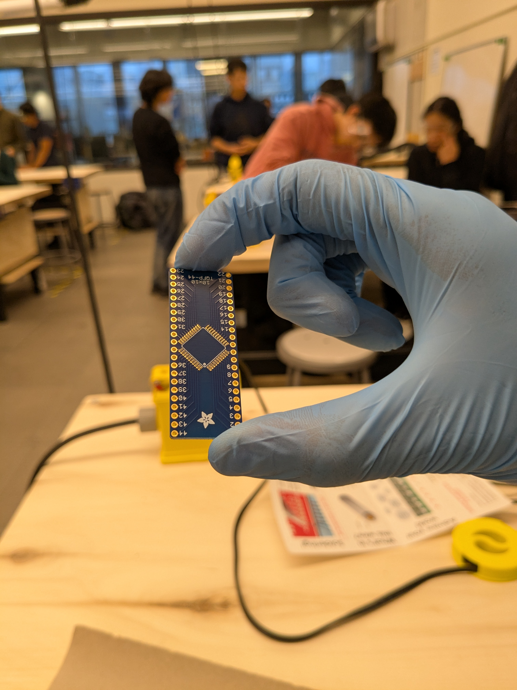
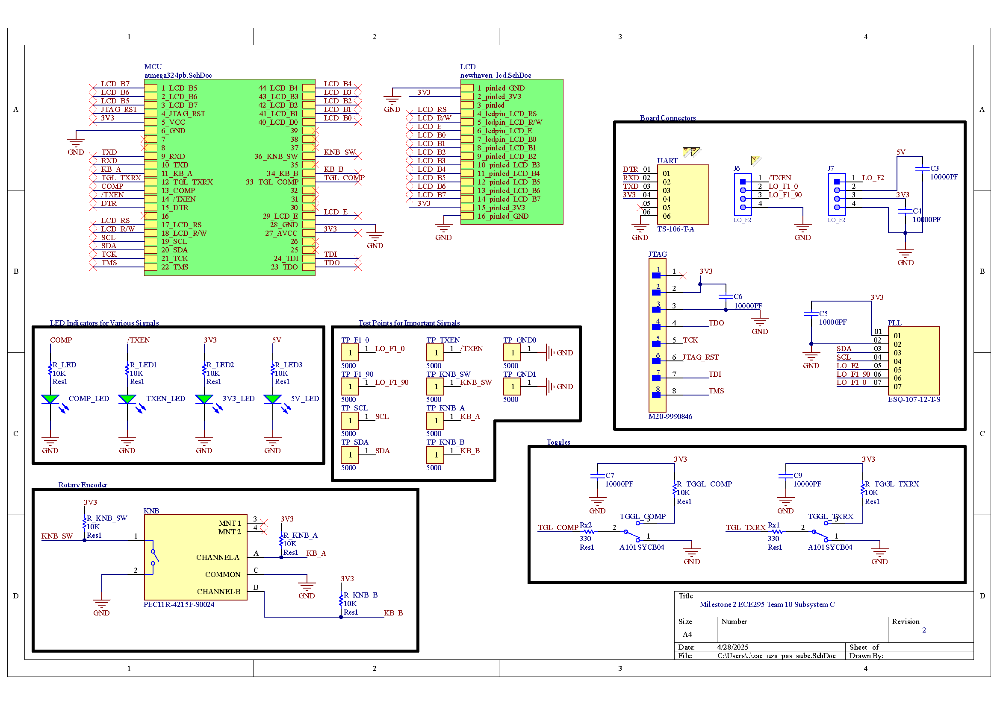
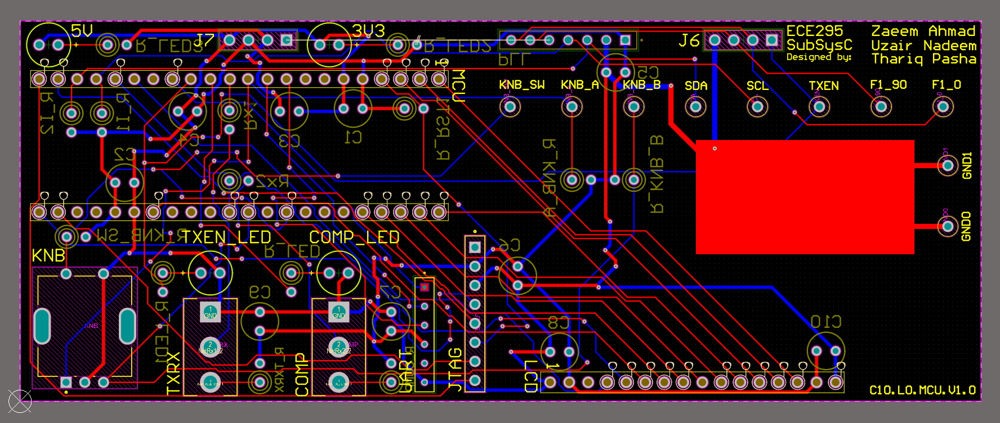
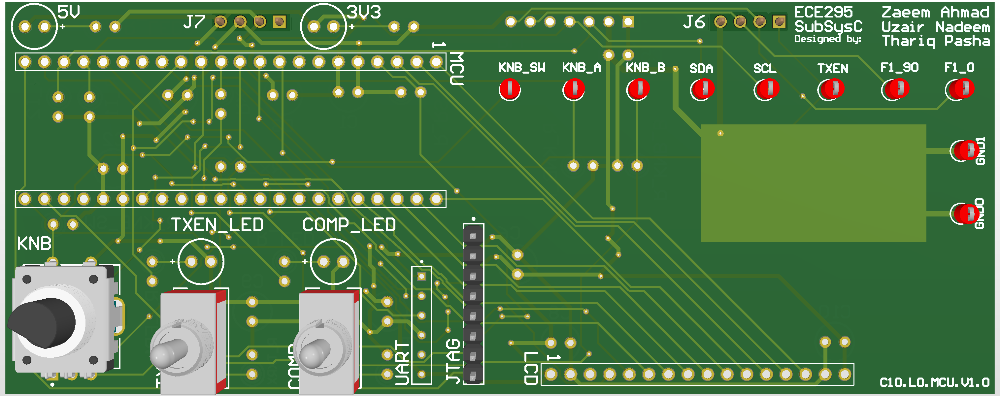
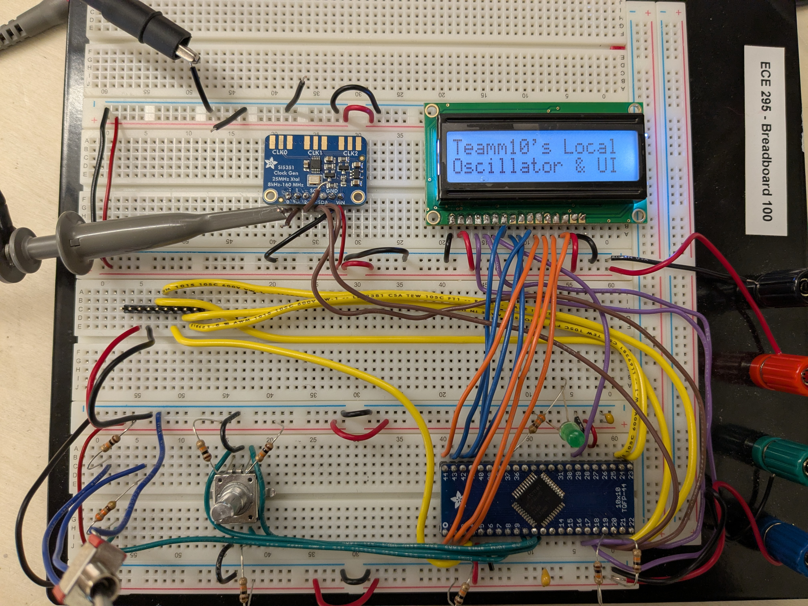
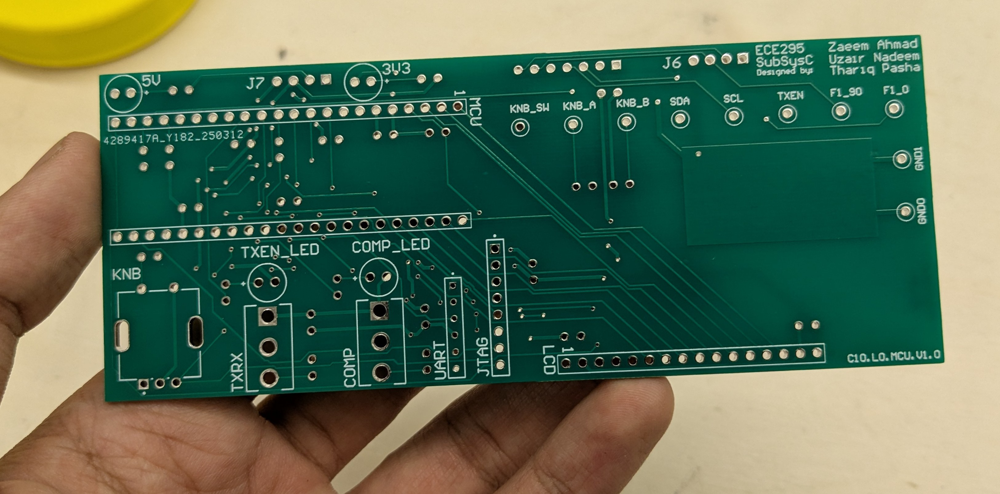

## Introduction

This project was undertaken as part of a second year design course called ECE295. It is a hardware design and communication course aimed at giving students a taste of some real electrical engineering (requirements, schematics, designing PCBs etc.) as well as the communication aspect of it (documentation, presentations etc.). 

The goal of the course is to create a flexible radio transceiver (FLRTRX). The FLRTRX designed in ECE295 is the hardware aspect of a software defined radio (SDR), which is a commonly used type of radio where many components/systems historically implemented as hardware are now done through computer software. 

Creating a full radio is a big undertaking, so the FLRTX was broken down into the six subsystems as shown in the figure below. The class of ~200 was broken into teams of three for a total of ~65 teams, resulting in about 10 teams per subsystem.

Our team was assigned Subsystem C, which was the local oscillator and user-interface. The local oscillator in a radio is supposed to generate two waves that are 90 degrees out-of-phase from each other. These signals are then used in other subsystems of the radio for DSP (Digital Signal Processing). The user interface of the radio allows the user to adjust the frequency of the waves generated, to change if the radio is transmitting information or receiving, and if the user would like to make these changes through a computer or through the device's switches and toggles. The user interface is also responsible for communicating all this information for anyone to see on a display on the module.

## Getting Hands On

The course started off by explaining the basics of a radio and a general overview of the hardware design cycle before teams were assigned subsystems. Next, we had several focused lab sessions to learn more about our specific subsystem, Subsystem C. 

Because Subsystem C was one of the two subsystems with a microcontroller (the other one Subsystem D), we got some background information on different types of microcontrollers available on the market and how they worked at a high level. To get some hands-on experience, we soldered our microcontroller, the ATmega324PB, onto a breakout board as shown in Figure 2 using solder paste and a reflow oven.

The next step was to get familiar with assembling a full circuit onto a PCB and using instruments for testing functionality. To do this, we were given a schematic for a DC voltage regulator designed to regulate 5 - 30V input voltage to roughly 5V output. The voltage regulator used an OpAmp, a BJT, and a zener diode as shown in Figure 3. To the right, you will see the completed circuit once connected to an input voltage.

We gained experience using electrical instrumentation tools while testing this voltage regular. We used a DC power supply, an AC wall-plug, and a waveform generator to provide various input signals to the board. We then used a digital multimeter (as per Figure 4) and oscilloscope to verify the output and check if the board met requirements (it did!). This little “warm-up” project prepared us for designing, soldering, and testing our real Subsystem C board.

## Our Team's Subsystem C

Once familiar with the processes and tools of hardware design, it was time to develop a local oscillator and user interface for the SDR. The project was divided into three major milestones named M1, M2, and M3 as shown in the figure below.

.")

During the first phase of the project, our team used the Interface Control Document (ICD) and design requirements to research and order components. For our subsystem, we narrowed it down to 5 critical components we would need in order to have a fully functioning subsystem. We would need:
* a microprocessor (ATMega 328PB) to interface all components of the radio synchronously.
* a clock generator (AdaFruit SI5351) to create two waves that are 90 degrees out-of-phase with each other.
* single pole double throw switches to toggle between four total modes: [1] allowing users to make changes on board  [2] through a computer connection, as well as allowing the user to toggle between [3] transmitting mode (TX), and [4] receiving mode (RX).
* a knob to allow the user to variably change the frequency of our waves. 
* an LCD (16x2 LCD) to communicate the current status of the radio.

During this process, our team delivered our first oral presentation (called OP1). OP1’s objective was to describe our subsystem to our communication instructor (acting as a product manager in industry) and persuade the audience how our project was on track. The presentation went very well, and the communication professor took slides from our deck as good examples during his lecture!

### PCB Schematic and Layout

Once we validated our schematic with our TA and passed the electrical rule on Altium, the next step was to create the PCB and layout the components. A few components didn’t come with footprints, but fortunately those were on breakout boards that we planned to mount to our subsystem C board with headers. We simply created pads/vias for the headers instead of the actual components. The figures below show the final schematic and layouts:

### Firmware

With the PCB validated and the design rule check passed, we ordered our PCB. While it shipped, our team focused on refining the firmware and making sure all parts worked as expected on the breadboard (Figure 9). 

To write the software for our subsystem, we used MPLAB X IDE with AVR programming and flashed code through JTAG onto the microcontroller. All components of our project were interfaced through interrupts to ensure the fastest possible changes for users. To change frequencies on our board, we programmed our knob in a way so that for coarse frequency changes, the user can press into the knob and then turn. For fine changes in frequency the user can rotate the knob normally. Finally, we showed all these changes on our 8-bit parallel port 16x2 LCD.

### Soldering, Assembly, and Testing

Once the PCB arrived, we got to work soldering as per Figure 10. Most of the components were straightforward, but a few of the larger ones like the toggles and the closely fitted headers and filter capacitors were a bit tricky. Fortunately, everything went well and the final assembled subsystem looks like Figure 11.

The final phase of the project was to perform unit testing before being eligible for full system integration. To have a fully functioning Subsystem C we had to be able to toggle frequencies through our UI from 3MHz to 30MHz, toggle between TX and RX mode, and display the current status of everything to the user. During this phase, our Subsystem C successfully demonstrated all intended functionalities in front of the TA. We were able to toggle frequencies through our UI from 3 MHz to 30 MHz, switch between TX and RX modes, and display the current status of all components. 

One minor caveat in our design was a slight delay when updating the PLL frequency from the knob to the PLL.This was due to the fact that the PLL modules input parameters were updated through polling even though the input from the knob was done through interrupts. However, this delay was barely noticeable to the naked eye.

During system integration, our board continued to perform flawlessly. All components such as the LEDs, toggles, TX/RX mode switching, and interactions between computer and hardware mode toggling worked as expected. Due to the small timing delay when updating the frequency on our board, the output frequencies generated (which were sent to the other subsystems) experienced a slight lag during integration day. Other than this minor issue, the integration was a success.

## What We Learned

This design course was a near constant grind, especially in combination with a full semester of other heavy courses. With that said, this project gave us a real taste of the hardware design process and what it’s like to be a real engineer. In real life, you won’t have a handbook to solve every problem. To be an engineer is to expect problem after problem and keep developing solutions to fix those problems. You design, build, test, and repeat. 

The course name is rather accurate as we gained an understanding of both the technical aspect of hardware design and also the communication (or “soft skill”) aspect. 

On the engineering design side of things, we interpreted Subsystem C’s requirements and specifications from the ICD and developed our own design to achieve those specifications and requirements. We gained proficiency using computer aided (CAD) and electronic design automation (EDA) techniques for hardware development through Altium Designer, our choice of schematic capture and printed circuit board layout tool. 

From a physical perspective, we demonstrated our ability to solder through-hole and surface-mount components. We gained confidence using electronic lab instruments for testing circuits, using results to demonstrate functionality or troubleshoot issues.  

Throughout all of the above, this project was an opportunity to work in a team environment while developing a complex hardware system. We applied a unique project management approach for this type of hardware development, with an overall waterfall scheme with smaller sprints in each phase of the project (refer to Figure 5). 

Most importantly, we learned to confidently prepare and deliver oral presentations to both a technical (our TAs) and non-technical (our communication instructors) audience to report on project progress and demonstrate subsystem functionality. For the technical audience in particular, we learned how to write a project proposal, blueprints, schematic documents, and test plans to document, demonstrate, and verify our design for functionality and compliance. 

Overall, this course was an incredible journey that transformed challenges into skills and prepared us to shape the future. It taught us that as engineers we don’t wait for solutions. We build them.