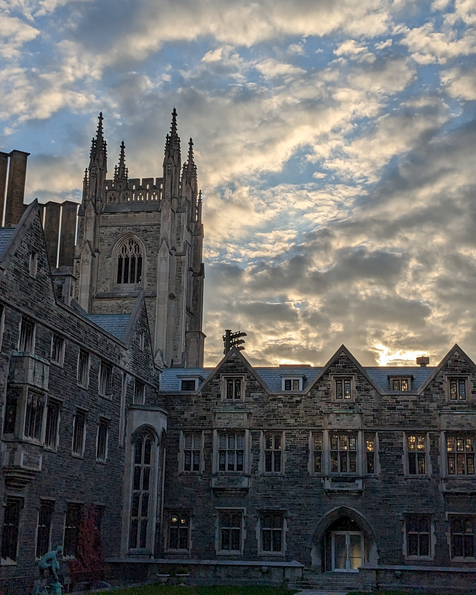

## Introduction
Engineering Strategies and Practice I (ESP I), one of the first year, first semester courses that all students in the University of Toronto’s engineering programs take, was my first taste of formal engineering design. The course was not only focused on training students in the design process, but also to problem-solve creatively, with methodology and credibility. The idea was to teach students about engineering in the real world, where technical knowledge about the sciences is only a single slice of the pie, with other elements such as teamwork, communication, and design taking larger—and oftentimes more important—portions.

Students in the course were divided into groups of four to six individuals; my team had six members, which meant my team was on the bigger side. I will expand upon the challenges and opportunities this brought to our team.

Our team created a team charter to define how we would work together efficiently in the course project. We set our roles, responsibilities, goals, and measures of success along with details on decision making and contingencies. 

I took initiative and became team leader, while other members took roles such as project manager, schedule coordinator, editor et cetera based on their skills and experiences.

## What Our Project Was
After team-formation came project assignments. The client for this year’s ESP I term was David Kim, the warden of Hart House. Hart House is a historic, neo-Gothic stone building located in the heart of the University of Toronto's downtown campus with facilities including a pool, a gym, a theater, study and event spaces, and a café. David coordinated with the ESP 1 to provide these three projects:

1. Project A: Theater
Hart House’s theater, which is located below ground level inside the building, has serious limitations in terms of accessibility such as sharp slopes and stairway-only access. This project’s goal is to make the theater more accessible to those with mobility issues.

2. Project B: North Alley
North of the Hart House building, there is a strip of land that is vacant and has little use other than as a shortcut passageway. This project aims to make use of this space by reimagining it as a “clean-slate” that is flexible and can be used for multiple purposes.

3. Project C: Wayfinding
Being a historic building that has constantly been reimagined, Hart House is sometimes very difficult and confusing to navigate. People get lost often. This project’s goal is to make wayfinding around Hart House easier and efficient.

To decide which project our team would pick, I took my team to Hart House directly to scope things out in person. We went for the Wayfinding project because we could relate to it the strongest, having experienced getting lost ourselves many times in that short visit. 

## How We Completed the Project
Learning how structured, methodological, and rigorous the engineering design process is was a delightful albeit taxing learning experience. As an overview, here are the steps I will expand upon shortly:
* Problem statement
* Service environment and stakeholders
* Functions, objectives, and constraints
* Idea generation
* Idea selection
* Proposed conceptual design

The first step of an engineering design is to define the problem. If you do not know the problem, you cannot devise a solution. The problem statement aims to give a comprehensive understanding of the problem while detailing the scope of the project. This was done by taking information from the client statement and the team’s own research into the problem. 

Next, the team had to do research on the service environment, which is an engineering term for where the design will operate. Learning about physical (temperature, electricity, other objects etc.), living (students, visitors, children etc.), and virtual (WiFi, BlueTooth etc.) elements is vital in designing a solution. 

Stakeholders, which are individuals or organizations that can be affected by (e.g., students, visitors) or can influence (e.g., University Governing Council), were also be researched and considered because it is important for the design to cater to the widest population as possible.

With all of that research, our team generated functions, which describes, using a verb, what the design had to do. For example, our design’s primary function was to let people find their way inside Hart House. 

Objectives describe, using adjectives, what the design had to be. For example, our design had to be reliable, easy to maintain, flexible, and attractive/intuitive. Constraints are a description of what the “rules” the design had to follow. For example, our design had to follow the International Symbol of Accessibility.

Once the project requirements were set, the team began generating ideas that met those requirements. Using various methods like brainstorming and morph charts, our team generated over 100 ideas. Then, using idea selection techniques such as multivoting and Pugh matrix, we narrowed it down to one proposed design and two alternate solutions. 

## Challenges We Ran Into
ESP I has one of the highest workloads of any course, and this is due to the novel nature of engineering design. This was not like the high school group projects everyone was used to doing. Design, teamwork, and communication—the “pillars” of engineering—had more depth to them than they had previously. 

Having six team members made things more difficult as team leader. Half the team were international students, of whom two had difficulty communicating in English. As team leader, it was my job to assign tasks and plan the team’s steps, so having so many members with different proficiency levels made things challenging. 

I was able to overcome a few of these by having those less comfortable with English do other tasks such as crunching numbers, researching, or scoping Hart House physically. Even then, some members did not get to contribute as much as others, so others—myself included—had to pull more weight.

Unforeseeable circumstances, such as our project manager falling ill at a critical phase of the project and another vital member dislocating her knee and being in the hospital the night before the final submission, caused us much stress, but fortunately we were able to manage and things turned out well in the end. 

## What I Learned

Being team leader of such a diverse team working on a real-world engineering project was truly an eye-opening experience for me. Working on this project made me learn more about myself as a leader. It helped me identify the things I need to improve on, such as splitting up tasks evenly, but also my strengths that make me a good leader, such as my focus, diligence, and incitement of inspiration. 

I also learned the engineering design process, and applying it as part of this project helped solidify that knowledge and demonstrate the importance of design in engineering. A condensed list of things I learned are defining a problem in engineering terms, scoping, researching the service environment and stakeholders, generating functions, objectives, and constraints, generating and selecting ideas, and finally proposing conceptual designs. 

I look forward to ESP 2, which is part two of Engineering Strategies and Practice taking place next semester, and applying my new knowledge on teamwork, leadership, and engineering design.