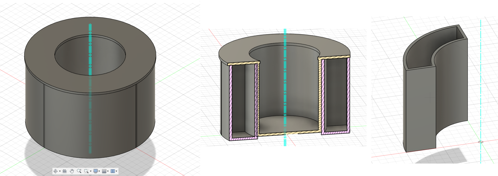
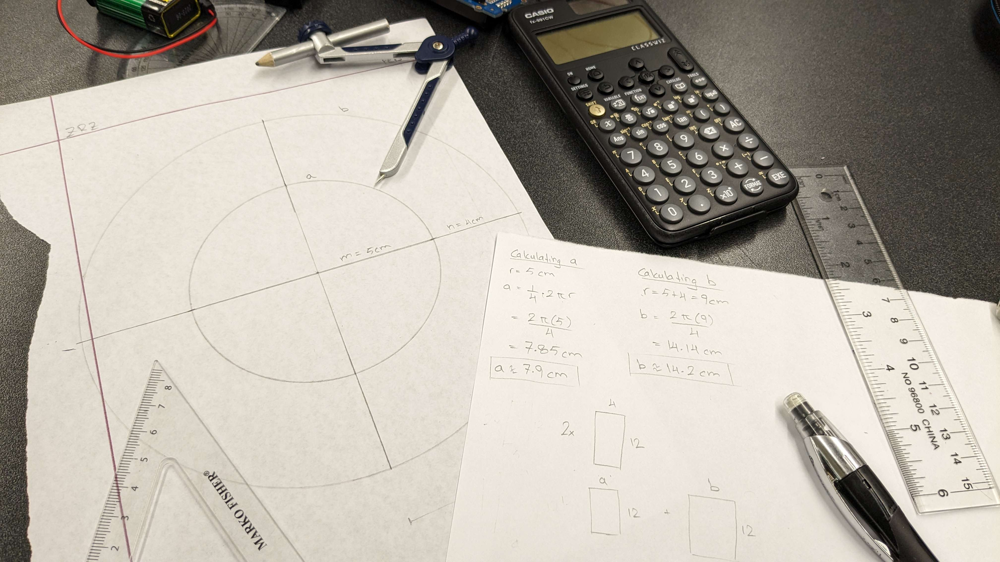

## Inspiration

Amid the challenges posed by the COVID-19 pandemic, nurses around the world found themselves overwhelmed with demanding workloads, leading to instances where they struggled to accurately identify and administer the right medications to patients at specific times of the day. This collective experience underscored the urgent need for a solution that could alleviate the mental strain on healthcare providers and enhance patient care. In response to this widespread challenge, MedTray emerged as a groundbreaking automated medication dispenser. With a simple press of a button, MedTray effortlessly rotates to and opens the correct medicine compartment, providing a transparent visual display of medications taken and those remaining for the day. This innovative device not only supports nurses but also ensures a seamless and stress-free medication management experience for patients.

## What MedTray Does

MedTray automatically rotates to and opens the correct medicine compartment at the press of a button. It clearly shows how many medicines have been taken and how many are left for the day. This removes the mental strain on the user to remember how many medicines they have taken on a certain day as well as how many medicines are left to take.

## How We Built MedTray

To start off the design, we first brainstormed together and sketched a few rough copies of what the medicine dispenser might look like. We finally settled on a cylindrical design since it allows the center to rotate over and open the correct compartments. It also gave us room to house our electronics in the center while having the medicine compartments around it, giving our design a cleaner look.

Next, Zaeem installed Fusion 360 and modeled the 3D design of the dispenser according to the sketches. Because of the 3D printing limitations, he had to break the design into 5 parts: 4 quarter circle sections and 1 centerpiece. In the meantime, Zaher was working on the slideshow presentation while Robert set up the Arduino.

Even though the team ran into many major hurdles and unfortunate events, we were able to finalize our design by using cardboard, tape, and hot glue. After putting our design together, we tested the Arduino code and electronic components to optimize them further. And with that, we have our design!

## Challenges We Ran Into

As mentioned above, the team ran into some serious trouble, the first one being the NFC not connecting to the Arduino board. This was because our board was not designed to work with an NFC that did not have its own transmitter (instead relying on the user's smartphone, for example). Because of this, we had to ditch the idea of an NFC-controlled dispenser and opt for a button-based on instead.

There were many other issues with the coding as well. We had to somehow code two motors with two different functions and operations into a loop that resets after 4 medicines taken (we opted for this number, but we could adjust it to higher or lower based on the number of medicines our user wants to put.)

In the meantime, Zaeem's 3D designs were sent to the 3D printer. However, because of the large volume of designs submitted, we later found out at night that our 3D designs would not be printed. This was a major hurdle, because our design relied on the 3D prints. In the end, Zaeem had to spend time at night measuring and scaling up a physical cardboard design which he and Robert cut out and assembled the following morning.

## Accomplishments We Are Proud Of

First of all, we're really glad that our design worked out. With all the hurdles we faced along the way, it seemed at times that things were doomed. The fact that our code worked with our hardware and our design worked with our electronics makes us really happy.

We're also really happy about how our teamwork helped us overcome the hurdles we faced. With camaraderie and team spirit, we helped each other out when things looked bleak. As well, we were able to learn many new skills that we hope we can apply to other contexts! We learned transferrable skills such as 3D design (using Fusion 360, an industry standard software), using Arduino IDE to get the hardware to do what we want, and finalizing the design by scaling, cutting, and assembling our design.

## What’s Next for MedTray

Given more time (and a 3D printed design), our design can be made much more user-friendly and human in design. Our design can also be made modular to allow for more medicines (instead of just the 4 compartments we have right now). If implemented, our design can help people from all walks of life, from the elderly at home to the nurses at the hospital. We truly believe our design's potential knows no bound!

, Robert, Zaher.")