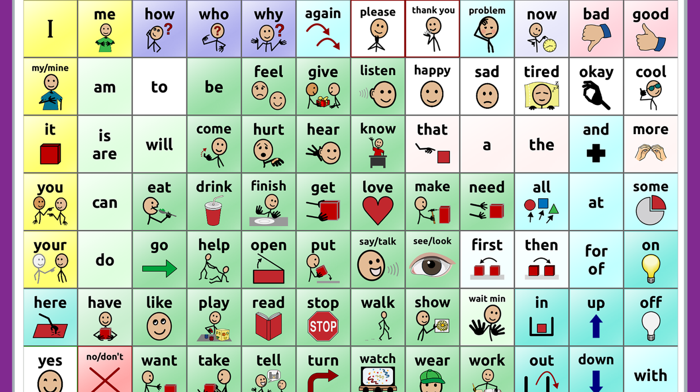
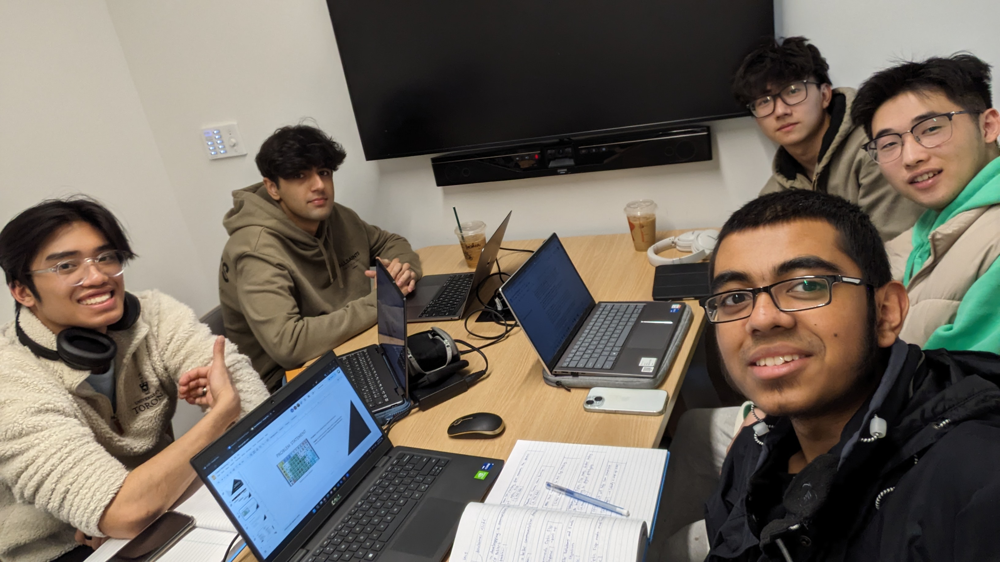
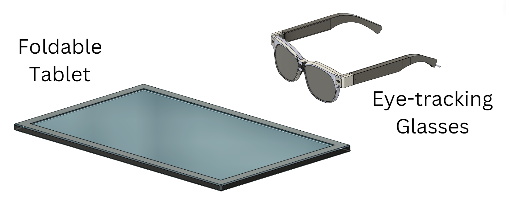
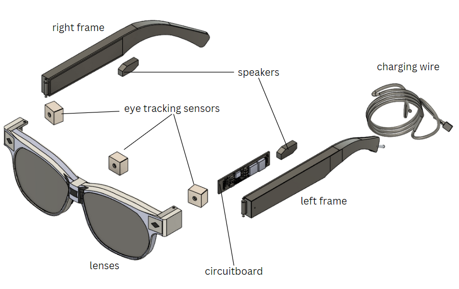
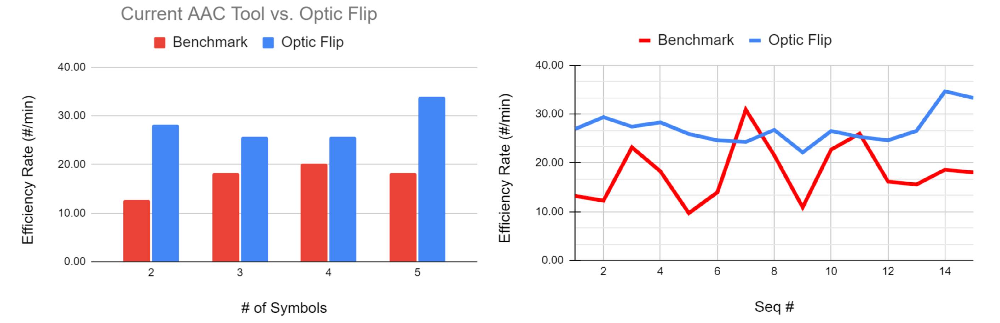
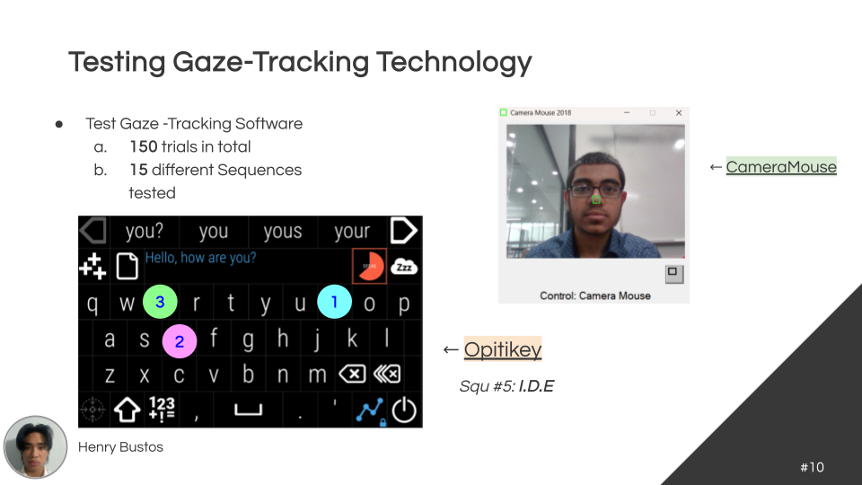
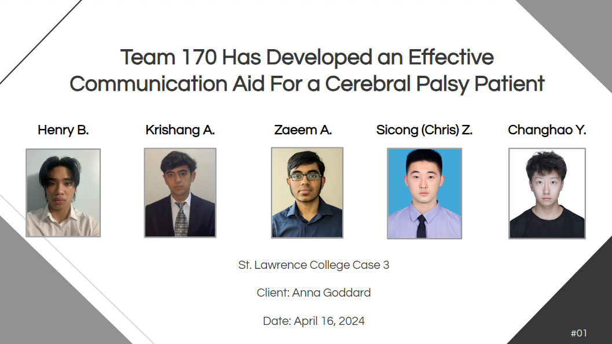
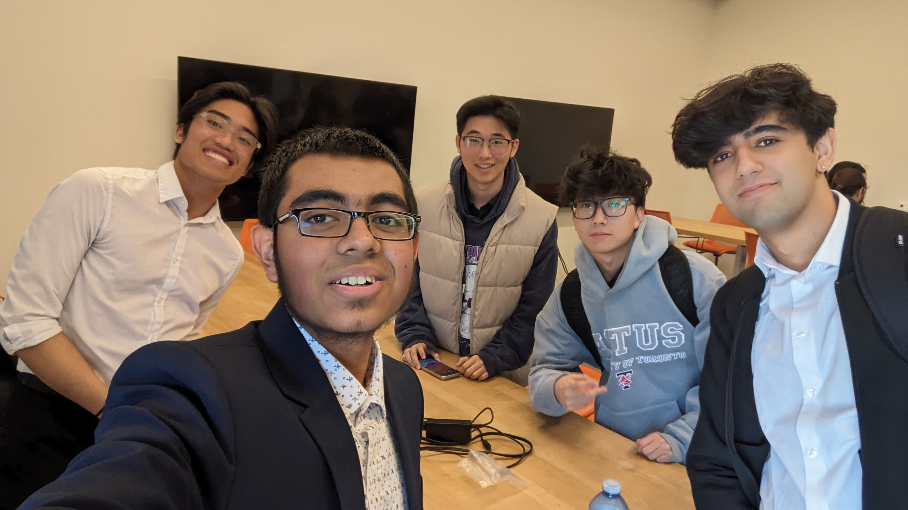

## Introduction

Engineering Strategies and Practice II (ESP II) was a continuation of ESP I, which I completed in first semester. In ESP I, students—myself included—got a first taste of formal engineering design and got to work on a realistic problem. ESP II, on the other hand, gave students a chance to work directly with a real-life client, complete with their own unique problems and challenges.

ESP II focused on project management, utilizing additional tools to improve teamwork efficiency—tools which are used in industry by large engineering teams. The design course taught students to interact professionally with a client and develop persuasive oral presentations, including a final presentation to the client at the end of the project. This formal presentation let the engineering teams present the evidence they gathered to persuade the client to implement the team’s recommended design. 

Like ESP I, our teams were assigned by the faculty. This time, our team had five members, which made things a little easier to manage. Even so, three members were international students, two of whom had some difficulty communicating in English. I, however, was up for a challenge, eager to put to use what I learned from ESP I as team leader, so I took the team leader role once more. I was determined to learn from my mistakes and grow as a leader, and ESP II provided the perfect opportunity for that.

## What Our Project Was

Our client was Anna Goddard, who is pursuing an Honours Bachelor of Behavioural Psychology degree at St. Lawrence College located in Kingston, ON, Canada. As part of her course, Anna and her teammate Nathan had been tasked with observing a patient and devising an intervention plan to correct problematic behaviour. Anna’s patient was a sixteen-year-old boy named Sam with cerebral palsy (CP). He had difficulty moving and communicating due to his condition but was otherwise cognitively normal. Sam used a low-tech communication board to augment his communication by pointing to words and pictures.

Sam had been displaying abnormal behaviour, such as yelling, throwing his communication board, and knocking things over. Anna and her team identified that these behaviours likely stemmed from the ineffectiveness of Sam’s communication board.

Sam’s communication board blocked him from effectively expressing strong emotions. It did not allow him to communicate seamlessly with others in a healthy and civilised fashion. Our team determined Anna needed a design that let Sam redirect his emotional outbursts through said design solution instead of through problematic behaviours such as throwing and yelling. The team would have to essentially design a solution that would be more appealing to use for displaying emotion compared to showing problematic behaviour.

## How We Completed the Project

Much like ESP I, our team applied the engineering design process by first defining the problem and scope before doing research on the service environment and stakeholders. Things were more exacting because we were dealing with a real client with such a unique challenge. 

Take the service environment for instance. Our design had to be usable indoors and outdoors, in all environments where a human would likely go. This meant a wide range of temperatures and humidity, along with exposure to rain, snow, and sunlight. Sam interacted with family, friends, peers, and animals such as pets or squirrels et cetera. The more requirements, the more complex the design.

As well, there were many legal and ethical considerations relating to stakeholders. Our team had to research NGOs supporting people with cerebral palsy, such as Cerebral Palsy Canada Network. The Government of Ontario was also a stakeholder because our design could be of interest to their Assistive Devices Program, where the design could be offered to individuals who didn’t have access to this type of technology. Further, companies that manufactured communication aids for people with disabilities were, naturally, also important stakeholders. These are a few examples, but it goes to show how much research was needed when working on a project that dealt with people and health. 

Just like ESP I, we used our research to generate functions, objectives, and constraints. Unlike ESP II, we had a real client whose opinions and suggestions mattered, so client meetings were an important step in our team’s process. After coming up with project requirements, our team had a meeting with Anna and Nathan to explain our understanding of the problem being solved, as well as the requirements our design would fulfill in order to be successful.

Once we got the green light from the client, we moved on to idea generation and idea selection. Just like ESP I, we used different tools to achieve this. However, before finalizing idea selection, there was an important step to complete. 

In industry, it is standard to have internal design reviews where engineering teams present their progress to company officials and other departments. It is important for engineers to be persuasive about their work so that their project keeps getting support from the company. At the same time, they have to be truthful and accurate about what they say. To mimic this and give us practice giving such high-stakes internal presentations, our team performed what is called a Design Review Gateway (DRG). 

The DRG, in our case, was a presentation to highlight our progress and persuade the faculty that our team was on track and our project was worth finishing. Once the team passed the DRG, it was time to finalize idea selection and come up with the team’s recommended design along with two alternatives. 

Our recommended design was called OpticFlip. It combined an eye-tracking pair of glasses with a compact, foldable tablet. The eye-tracking sensors in the pair of glasses send information wirelessly to the tablet. The tablet’s software uses this data to determine where Sam is looking. This design lets Sam operate a high-tech communication tablet with specialized software without having to use his hands; he simply had to move his eyes. 

The other two designs were called MyVoice and Babble BoX. MyVoice was a light tablet with an emphasis on customizability based on the user’s desires. Its highlighting feature was extremely optimized software prioritizing efficiency. Babble BoX, on the other hand, made use of a dynamic screen connected to a pair of controllers. The controllers were designed to be similar to the ones Sam uses for playing video games. This design’s highlighting feature was “gamifying” the communication experience to make it more appealing to Sam.

In the end, OpticFlip was proposed as the recommended design because, compared to the other alternative designs, the Optic Flip’s eye tracking offered Sam the easiest way to communicate in a manner that didn’t draw attention to himself, giving Sam a sense of autonomy with his own voice.

Another matter unique to ESP II was the planning and implementation of “measures of success,” or MOS. The MOS was essentially a testing plan to generate evidence as to whether or not the proposed design performed as expected in the objectives. 

In our case, the MOS involved 3 main stages: the estimation, modeling and prototyping stage with the goal being to prove the feasibility and effectiveness of Optic Flip design. The test plan’s main objective was to prove that the design’s eye tracking feature was the most effective method of receiving user input in terms of usability and ease of use. 

We did so by using a gaze-tracking software called CameraMouse as a preliminary step to eye-tracking coupled with an eye-gesture-based input application called Optikey. With this setup, our team tested different sequences that Sam was likely to input. We timed these tests, and after 150 trials and 15 sequences, we were able to determine the efficiency of our design’s setup compared to current communication solutions for cerebral palsy patients.

With our design process complete, it was time for the final presentation. In attendance were engineering managers and project clients. The final presentation was a crucial step at the end of the design process because it would determine whether or not the client would implement the team’s proposed design. Things turned out well, with our team being persuasive and answering questions.

## Challenges We Ran Into

This project was much more demanding compared to the Hart House Wayfinding project from last semester. Part of the reason was the fact that we had real clients with a real problem to solve. Also, we were expected to provide a proper design and test it to ensure its success. Further, the project timeline was made very similar to real engineering teams in industry, complete with client meetings, design review gateways, and client presentations. We also used professional project management tools and methods to make collaboration and planning easier. 

The problem we were faced with was itself quite a challenge. Designing a communication device for a cerebral palsy patient is a complex task requiring skill from different areas of science and engineering. It helped that our team was composed of electrical engineering students, and Anna and Nathan were behavioural psychology students, so we were able to collaborate on creating the design. 

Furthermore, leading a cross-culture team in such a fast-paced project was indeed a difficult yet doable undertaking for myself. As mentioned earlier, some members had trouble communicating effectively in English, so I had to accommodate the team’s resources. Overall, I do believe I learned a great deal from facing these challenges, and I’ll expand more upon these below.

## What I Learned

The first thing I realized was how important it is to have a growth mindset. Coming out of ESP I, there were things I knew I had to improve on. Identifying these growth areas is something ESP has taught me, because going into ESP II, I knew what I did well and what I had to work on. 

For example, I knew I was able to motivate team members to put their best effort without being overly authoritative or controlling. At the same time, I knew when to be more direct if members began slacking off. I also knew how to see the big picture of the project without getting lost in the smaller tasks/details. This helped me steer the project in a way that ensured there were no last-minute crises. Good leadership qualities like these, I learned to improve upon. 

I also learned to better manage the team’s resources. I am especially grateful to our project manager Henry Bustos for being a solid rock of support; together we were able to efficiently manage our team’s time and effort. I also learned to be more considerate and find more tasks for those who were less comfortable with English. 

It goes without saying that ESP II improved my professional oral and written communication skills, and it also gave me confidence when coming up with persuasive engineering arguments. I learned to use project management tools such as Gantt Charts as well as more technical tools such as AutoCAD Fusion 360 to create design mockups. 

Overall, I am grateful for the “full-package” experience both ESP I and II have given me, and I look forward to applying my knowledge, skills, and experience in my future endeavors. 

