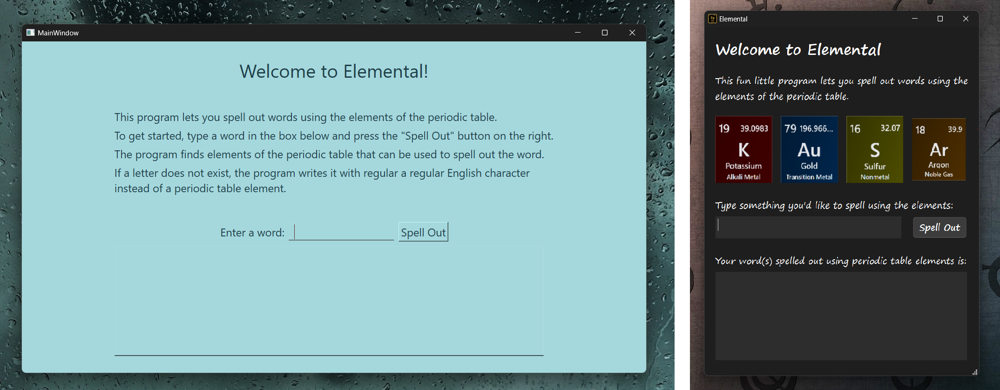
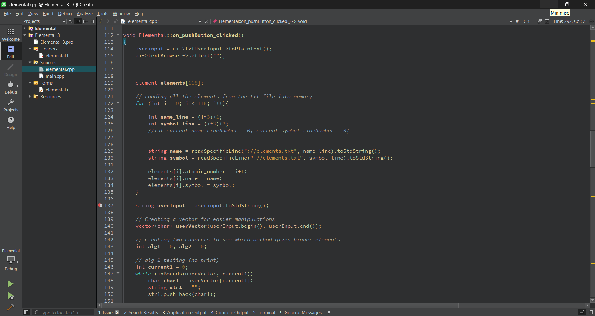
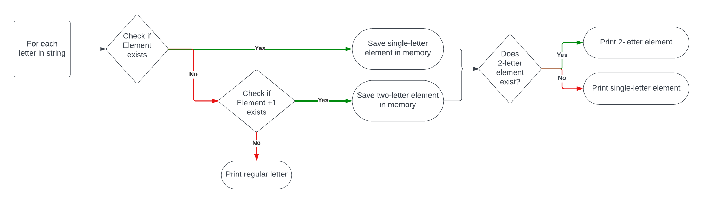
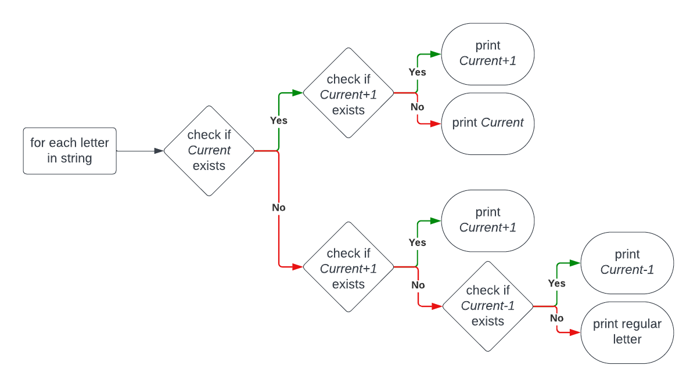
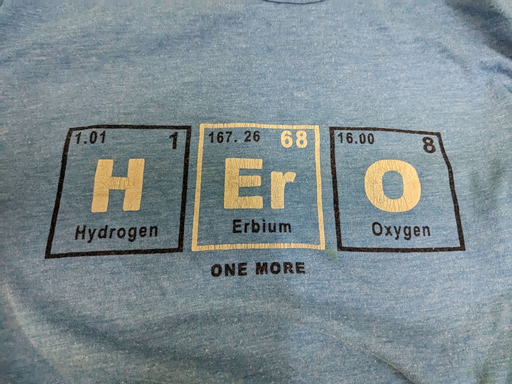

## Inspiration

My favourite courses in high school were the senior chemistry courses, SCH3U and SCH4U. Part of the reason was the actual chemistry content, which I found fascinating, but the bigger reason was my teacher. I loved learning in her class, and she was one of my best teachers in school. 

We had our high school chemistry classes in the school’s laboratory. Likewise, my teacher spent most of her day in the lab. It was known as *her domain* so to say. Outside the lab’s door on the opposite hallway wall, there was a whiteboard roughly the shape of a sheet of paper but about half the size of a standard door. On it, my teacher wrote little words of encouragement, advice, quotes, and chemistry jokes. She would often spell things out using the elements of the periodic table. For example, when making an oxygen joke, she would spell out oxygen as O x Y Ge N where O stood for oxygen, y for yttrium, Ge for germanium, and N for nitrogen. 

However, it is difficult to spell out most things in *periodic table* because one would need to know the names and symbols of all the elements. Also, certain combinations of letters could be spelled in different ways. Some combinations would give you more options with elements than others. 

To solve this problem, I decided to create a computer program. Introducing… Elemental!

## What Elemental Does

Elemental can be thought of as a utility program. It accepts a string from a user and then uses algorithms to determine the best way to spell it out using periodic table elements. For example, if the user entered the name “Kausar”, then the program would spell it out as such:  
&nbsp;&nbsp;&nbsp;&nbsp;🧪 K &nbsp;&nbsp;&nbsp;&nbsp;&nbsp;Potassium (Atomic number 19)  

&nbsp;&nbsp;&nbsp;&nbsp;🧪 Au&nbsp;&nbsp;&nbsp;Gold (Atomic number 79)  

&nbsp;&nbsp;&nbsp;&nbsp;🧪 S &nbsp;&nbsp;&nbsp;&nbsp;&nbsp;Sulfur (Atomic number 16)  

&nbsp;&nbsp;&nbsp;&nbsp;🧪 Ar &nbsp;&nbsp;&nbsp;Argon (Atomic number 18)  

When I say “the best way” to spell out, I am talking about the number of letters being substituted by elements. The higher the number, the better. This may seem like a niche scenario, but when you go over two or three-letter words, there are multiple ways to spell them out using periodic table elements. For example, take the word “hero.” You can spell it out in two ways:

| Spelling 1                                                       | Spelling 2                                                 |
| ---------------------------------------------------------------- | ---------------------------------------------------------- |
| 🧪 **He** &nbsp;&nbsp;&nbsp;Helium (Atomic number 2)              | 🧪 **H** &nbsp;&nbsp;&nbsp;&nbsp;Hydrogen (Atomic number 1) |
| ✒️ **r** &nbsp;&nbsp;&nbsp;&nbsp;&nbsp;&nbsp;&nbsp;Regular Letter | 🧪 **Er** &nbsp;&nbsp;&nbsp;Erbium (Atomic number 68)       |
| 🧪 **O** &nbsp;&nbsp;&nbsp;&nbsp;&nbsp;Oxygen (Atomic number 8)   | 🧪 **O** &nbsp;&nbsp;&nbsp;&nbsp;Oxygen (Atomic number 8)   |

As you can see, spelling 2 uses more periodic table elements, and is therefore more desirable.

## How I Built Elemental

In first year second semester, I took a programming course in C. While it got demanding at times, especially near the end, I found the challenge of programming enjoyable. To practice my skills a little and to get a headstart on next year’s programming courses, I planned to create something using C++.  After consulting a professional engineer with over a decade of software engineering experience, I decided to go with C++ for functionality and the Qt framework for the GUI. 

I made a habit of writing out on paper my thoughts and ideas on how to structure the program before starting to code. This helped me write out the skeleton for several functions essential for my program to work, which include:
* A struct or vector to organize the periodic table elements
* A way to store all the periodic table elements, either in memory or as a resource file
* A way to load or import the elements into memory if I decided to use a source file
* Several functions to handle input and output
* Some algorithm(s) for determining the optimal spelling

Using this, I was able to create a skeleton program in C++ with input/output through the terminal. Once I fixed my code’s logic, I moved on to creating a GUI version. As mentioned earlier, I used the Qt framework to design the graphical user interface and its interaction with my code. I started putting my code into the Qt Creator program and went to work designing the GUI, which went through a few design iterations:

The longest phase of the project was migrating the pure C++ code from VS Code to the Qt Creator IDE and getting it to run. Because Qt used a slightly different flavour of C++ with Qt’s own libraries and functions, it took some time to understand all of that. 

Once all of that was done, I packaged and exported the program into a single executable. Because Elemental needed information on all the periodic table elements as a resource file, I had to install it in a path containing the resource file. This is how I shared the app with my teacher.

## Challenges I Ran Into

While creating the initial C++ skeleton code in VS Code, the most challenging part was coming up with a good algorithm to spell out words/phrases. What I did was first have a pointer pointing to the first character of the user-inputted string. Calling this pointer *Element*, we have the following algorithm:

The while implementing this algorithm did spell out words in *periodic table*, there were a few problems that arose after some testing:
* This algorithm only tried finding elements for (a) letters currently being pointed to and (b) the letter being pointed to + the next letter. For example, given the word “hero”, and say Element currently pointing to the letter “h”, the algorithm would first search for the letter “h” and find hydrogen. Then it would search for “he” and find helium. Because the last step favours 2-letter elements, the program would print out “He” for helium and move on to the letter “r”. Because there is no element with the letter “r”, it would try “re”. Since “re” doesn’t exist either, it would simply print out “r” and move on with the word. The final answer would have only two elements, and we know this isn’t the best way to spell hero (see section 2).

* This algorithm did not check letter combinations *before* the letter currently being pointed to. Ideally, a more thorough algorithm would check all three cases:
1. The letter itself
2. The letter itself + the letter after
3. The letter itself + the letter before

* Further, this algorithm had no way to know if a certain spelling method was the best one or not. For example, given the two ways to spell “hero”—one with two elements and the other with three—the algorithm would go for the first and therefore worse option.

Now the new challenge was to come up with an algorithm to solve these issues. The new algorithm would need to check all three cases for searching elements as well as figure out which spelling method had the most number of elements. This time, calling the letter being pointed to *Current*, the new algorithm looks as such:

## What I Learned

Being my first full-fledged GUI program built from scratch, I was able to make use of my new programming knowledge from first year as well as learn some new tools. For example, it was my first time using C++ as well as the Qt Framework and Qt Creator. I learned how to break down a relatively complex problem into smaller parts, debugging each section before moving on to the next. I learned to iterate my design, assessing current algorithms through rigorous testing to find areas of improvement before expanding upon them. Overall, it was a challenging yet satisfying experience.

Trying to build a real-life program is likely the best way to learn new languages and tools. Plus, I was able to showcase this app to my teacher, who ended up liking it a lot. She even wanted to install it on her home computer!

