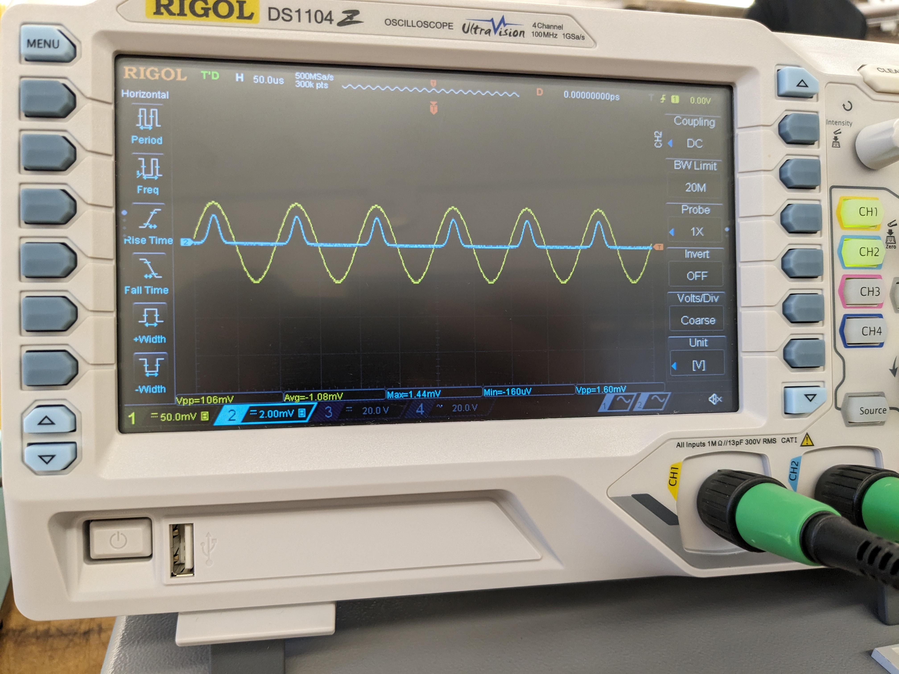
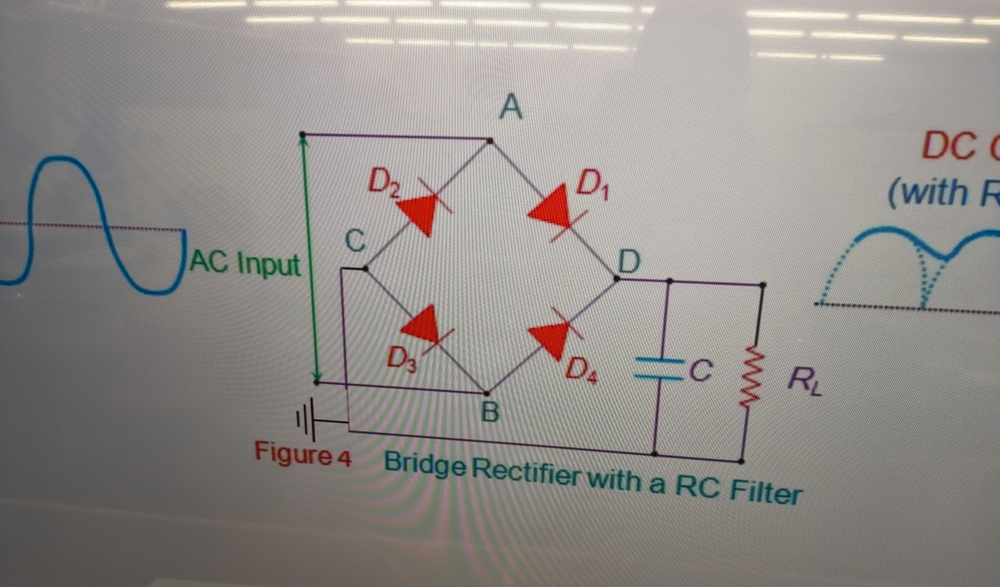
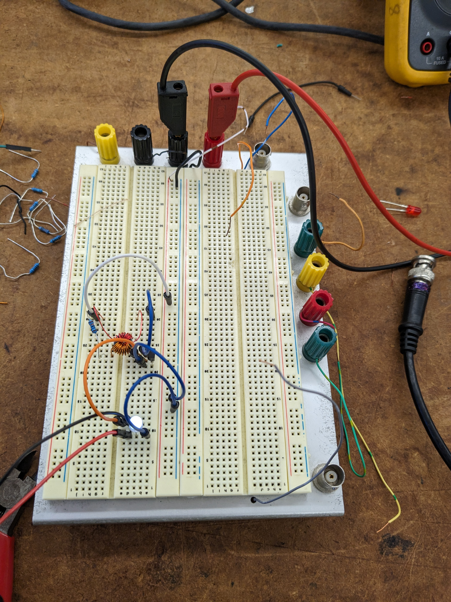

## Introduction

Professor Hamid Shokrallah, an experienced professor in the Electrical and Computer Engineering (ECE) department of the University of Toronto, had been holding ECE summer workshops and hosting competitions for the past few years. Naturally, my interest was piqued after making this discovery, so two of my friends and I decided to attend. 

The workshop spanned a few weeks and was divided into two: a hardware workshop and a robotics workshop. Here, I talk about the hardware workshop; robotics is discussed elsewhere.

## What We Did

Coming out of ECE110, we were familiar with electrical components such as resistors, capacitors, and inductors. But to create real-life analog circuits, other components were necessary. To teach us these, the workshop coordinators had the workshop split into 4 different phases, which are as follows:

<u>Phase 1</u>: This first phase was a review of ECE110. We were given a refresher on linear circuit elements like resistors, capacitors, inductors etc as well as parallel/series circuits. We practiced some hands-on skills such as soldering, and we made use of breadboards, DMMs, function generators and oscilloscopes. 

<u>Phase 2</u>: Next, we were given a preview of what some second year electromagnetics courses (ECE212/231) would teach. This included learning about semiconductors (pnp, npn etc.), diodes, LEDs, transistors (MOSFETS etc.). We built an astable multivibrator and used op-amps to create amplifiers and inverters. 

<u>Phase 3</u>: Then we started building more involved analog circuits. We learned about pulse width modulation (PWM) and DC motors to build an H-bridge circuit. We also looked at photoresistors and phototransistors to see how colour detectors worked.

<u>Phase 4</u>: After learning about coupled inductors and generators, we built a joule thief circuit to power on LEDs. The workshop ended with a competition to see which team could light up the most number of LEDs using a hand-crank generator. We were to mix and match and “build” the ultimate circuit using everything we learned.

## What We Built

This workshop in particular was especially enjoyable for me because it let me handle electrical lab equipment in a stress-free environment. Unlike the ECE110 labs, the work done here was motivated purely by real-life application, and Professor Hamid and the coordinators Samantha and Basil were very interactive and made things fun for us. I am going to share some of the things we built and did:

<!-- 
[How capacitors are used to smoothen the fullbridge rectifier's output signal.](https://youtu.be/ctY8QRzDz8c) -->

<!-- 
| Here are a few videos showcasing the astable multivibrator, an inverting amplifier, and an H-bridge |
| --------------------------------------------------------------------------------------------------- |
| Video of astable multivibrator with two red LEDs                                                    |
| Red and blue LEDs (like a police car)                                                               |
| Blue, green, and white LEDs                                                                         |
| Video showcase of inverting amplifier                                                               |
| Video showcase of H-bridge + PWM + DC motor                                                         | --> |

## What I Learned

This workshop was vital for me going into second year. Not only did it give me a chance to practice what I learned in first year, it gave me a preview into some second year concepts. The labs in ECE110 were quite rushed and a little stressful, so I didn’t get to explore and enjoy using the electronic equipment. This workshop gave me that chance to explore, make mistakes, and learn. I’ve gained more confidence and some intuition with regards to discrete analog circuits and how to use electrical equipment. 

As well, it was amazing to learn how people went from discovering semiconductors to creating revolutionary components like diodes, transistors, MOSFETs etc. Going through multiple levels of abstraction to “build” useful circuits (inverter, rectifier, H-bridge, Joule thief etc.) was eye-opening indeed. 

This workshop and the mini-projects within made me look forward to second year hardware courses and the world of electronics. 
