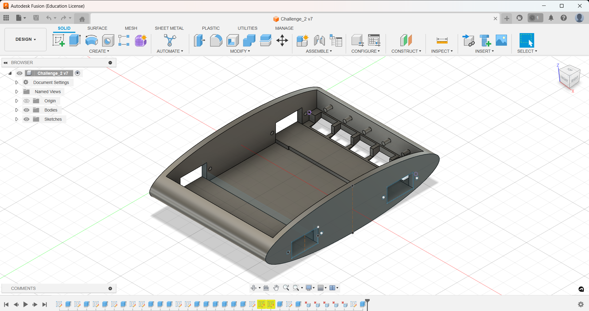
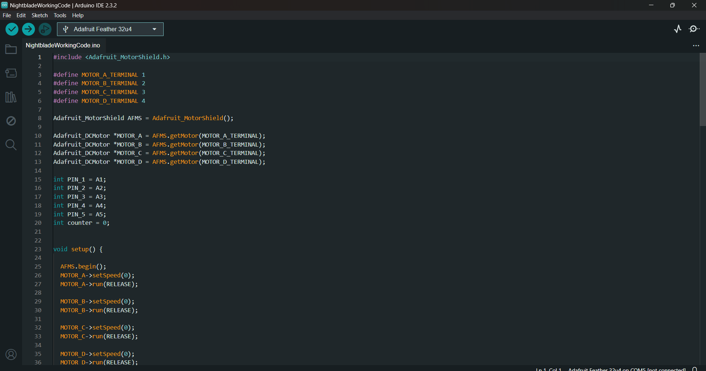
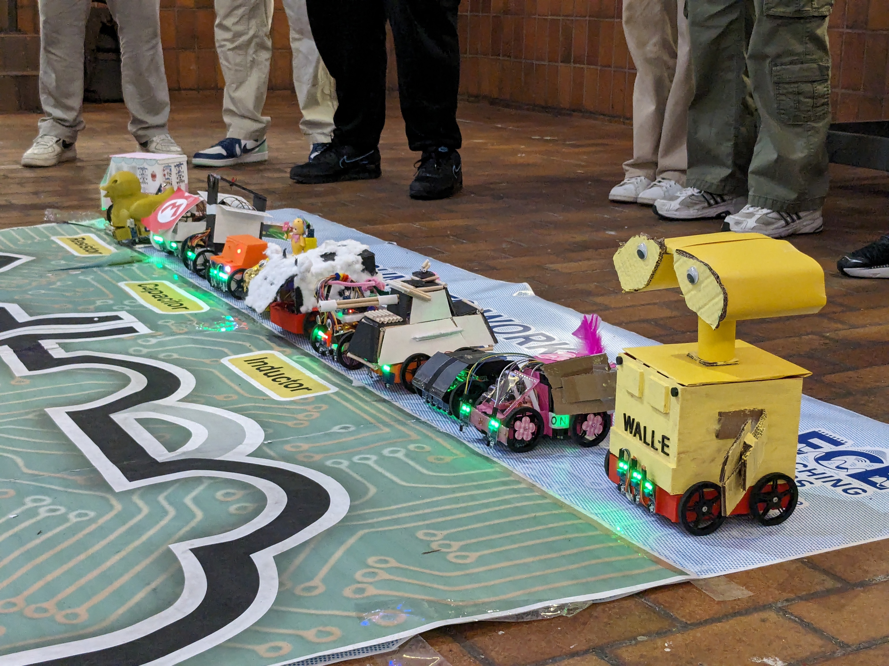

## Introduction

As mentioned earlier, Professor Hamid Shokrallah of the Electrical and Computer Engineering (ECE) department at the University of Toronto had been holding summer workshops for ECE students. Part two of the workshop focused on robotics and microcontrollers, building on hardware knowledge gained from workshop one and combining it with software and CADing to create autonomous robots.

## What We Did and Built

This workshop had two phases: a guided learning phase and a design challenge phase.

<u>Phase 1 - Guided Learning</u>: We learned how to use AutoCad Fusion 360, which is a computer aided design (CAD) software used to design robot chassis. We then learned about microprocessors and how they worked with other components and peripherals to form a microcontroller. To apply our knowledge, we used given specifications to model and 3D print a robot chassis. 

<u>Phase 2 - Design Challenge</u>: We were to compete in two races: one with robots whose CAD design was already given to us and one where we had to design our robot from scratch. For the first challenge, we already had our chassis from phase 1. We had to complete the robot by installing wheels, motors, and microcontroller. We then programmed the robot to follow a black line using data from IR sensors affixed to the robot’s front. 

After much trial, error, and testing, our robot, dubbed Orange Bolt (guess why) was able to complete the track. After some tuning, we were ready for the competition, which would be two timed laps around the track. [Here is a video of one of our robot’s timed laps](https://youtu.be/bRltscjyPlU).

## Developing Nightblade

For the second competition, the challenge was to design and build a robot from scratch, from drawing up rough sketches to CADing the chassis to tuning our algorithm and testing our code. After brainstorming together, my teammate and I decided to go for a sleek, curvy design. It would have a low profile to help with weight distribution and stability, and we designed special instructions at the nose through which our IR sensors would go.

After the 3D print came out, we spent a considerable amount of time fitting up the chassis with all the components, such as the motors, wheels, microcontroller, battery pack as well as wire management. This took some time because we had to be thoughtful about how and where to place the components to save space and keep the weight distributed. Aesthetics, unlike in the previous robot, played an important role as judges would pay attention to the coherence and attractiveness of our design, which we named *Nightblade*.

The programming portion of this challenge was the most demanding part of the whole experience. Because the racetrack had a different, more complex terrain with zigzags, confusing patterns, tight turns, and even a ramp, our robot had to be controlled by a robust algorithm capable of tackling all of those obstacles. In addition, the robot had to start and end on its own using signals from the IR sensor, which was an added challenge to the already daunting task. 

After a few days of working, we were successful in our endeavor and managed to complete testing and fine-tuning of our algorithm in time for the big challenge day. We were timed on three runs, of which the lowest time was taken. We came in second place, narrowly losing to the first place team by less than one second. [Here is a video of our first timed trial](https://youtu.be/FEt-2VCVJwU).

## What I Learned

The design challenge was an appropriate conclusion to the summer ECE workshops. It was a culmination of the hardware and software knowledge and hands-on skills gained throughout the duration of the workshop. It gave me new-found confidence in dealing with electrical equipment and invigorated me anew with interest in digital electronics and logic. In other words, I was hyped up for second year ECE. 

I’d also like to comment on the pleasant camaraderie that arose as all the teams worked side by side for weeks. It was great getting to know people and working with them in the same lab using the same tools. It amazes me how creative people are—not a single design looked like any of the others. To demonstrate my point, here is a collection of all the robots every team designed:

