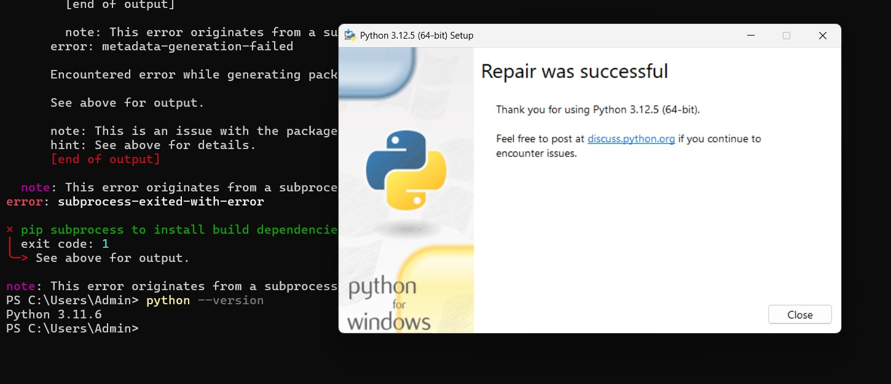

## Introduction

Near mid-July, I had a conversation with [Mr. Sakib](https://www.linkedin.com/in/sakibulhasan/), a senior data engineer about a new data project he was initiating. My friend Mohammad and I were interested in this data project since we did not have any prior experience working with big data. Mr. Sakib agreed to let us work with his team so we could get some exposure in this sector.

Mr. Sakib recently founded a data solutions firm called [Datavvy](https://datavvy.com/) (formerly called [KrossKut](https://krosskut.io/)). The firm’s latest client was a ceramics company called [Artisan Ceramics](https://artisan.com.bd/). This company wanted to have their data on sales, materials, costs etc. analyzed in order to generate useful information like predictions, warnings etc.. Our job as part of KrossKut’s data engineering team was to develop a system to analyze Artisan Ceramics’ company data and generate useful information.

## KrossKut’s Data Analysis Platform

As KrossKut is a newly founded entity, my friend and I were involved in creating the core data analysis platform. During the first few days, our team did research and came up with a flowchart on how different tools needed to be put together:

Once the general plan was set, the team researched several tools, which are mentioned below:
* Source: csv file, Excel file, MySQL, Oracle, PostGre
* Importer: Spark, Airflow
* Data Lakehouse: Iceberg
* Query Engine: Dremio, Trino, Clickhouse
* Visualization: Superset, Tableau, Power BI
* Platform: Google Cloud Platform (GCP), Amazon Web Services (AWS), Azure, On Prem, Data Centre, Kubernetes

There were many pros and cons to using each of these services. For example, data centres such as DhakaColo or RobiCloud were more economical as was On Prem. However, there was a risk of data loss if the team went for an on-premise approach. In the end, the team decided to use Dremio, MinIO and Superset containers to get a viable proof-of-concept (POC) running, and then migrate the system onto Kubernetes. 

## What We Did

While other members of the team worked on dev-ops, marketing, and graphic/UX design, Mahrus and I worked on implementing a simple use case as a demo for Artisan Ceramics. We were to show an analytical representation of the data provided by the company on their materials consumption over the past forty-eight months. To do this, we used Minio (an Amazon S3 compatible object storage system) as our data source, Dremio as our data lakehouse and Superset as our visualization layer. We used the container runtime environment Docker to separately run all our applications. 

### MinIO

MinIO is a high-performance, open-source object storage server that is compatible with the Amazon S3 API. We chose it because it is scalable and offers distributed storage solutions. First we created a S3 bucket named “warehouse”. Then we imported all the files given to us by our client into the “warehouse”.

### Dremio

Dremio is a data lakehouse platform designed to provide self-service analytics. We chose it because it can query data from various sources, including data lakes, data warehouses, and cloud data stores.

We connected our MinIO S3 database to Dremio and performed data cleaning and transformation tasks to make it suitable for analysis.

### Superset
Superset served as our UI and visualization tool. We connected Dremio with Superset using the SQLAlchemy connector, a python library that helps to connect python applications with various databases. Then using the cleaned data we used a line chart to visualize the trend of material consumption through 2021-2024 .

### Prophet Library

Using meta’s prophet library, we attempted to predict the future consumption amount of each material. We used python to prepare the data and visualize using matplotlib library. Below is our code. The code is inspired by this [video](https://www.youtube.com/watch?v=L2gkU7nBj9w).


import pandas as pd
from prophet import Prophet
import matplotlib.pyplot as plt

#Load the data from a csv file
data = pd.read_csv('DATA.csv')
#Convert the timestamp column to datetime type
data['Month'] = pd.to_datetime(data['Month'])

#Rename the columns to 'ds' and 'y'
data = data.rename(columns={'Month':'ds', 'Feldspar':'y'})

#creating the prophet model object
model = Prophet()
#fitting the data
model.fit(data)

#Generate future dates for the next 30 days
future_dates = model.make_future_dataframe(periods=12, freq='M')

#Make predictions
forecast = model.predict(future_dates)

#Visualize the results.
#We can make a better visualization by specifying the grid space and other configuration.
plt.figure()
model.plot(forecast, xlabel='Date', ylabel='Sales Qty')
plt.title('Sales Forecast')
plt.show()


Below is the future 12 month predicted data visualized. The blue line from 2024-06 to 2025-06 is the prediction; the lines with the datapoint are the historical data.

## MATLAB

While Mohammad worked on the Dremio + Superset combo, I worked on creating a MATLAB script that would use the data over the past couple of years to do data projection using polynomial data fitting. These were based on the things I learned in linear algebra in first semester, and it has to do least squares approximations. Explaining how it works goes a bit beyond the scope of this document, so I will leave that up to research for those interested. Instead, I am including some of MATLAB code snippets: 

## Challenges We Ran Into

### Dependencies compatibility issues

Several of the tools required certain python packages and dependencies. However, we had problems installing and running these dependencies since many were not compatible with specific versions of python. For example, “np.float” no longer existed as part of the NumPy 2.0 that came with the more recent version of python. To fix this, I tried using a different machine, but even that wasn’t working. Fortunately, Mohammad got things to work on his side, so he carried on with the prophet and pandas packages.

### Version compatibility issues
For the duration of this project, there were some very specific things that prevented my computer from running many of the tools. For example, I was unable to run npm properly even though it was installed. Later it was determined that version compatibility issues were causing these problems. It was suspected that multiple versions of python may have had conflicting system PATHs.

### Superset driver issues
When connecting Superset with Dremio’s database, I faced a database driver error. I looked into it and found out I need to install a Python DB-API database driver and a SQLAlchemy dialect for Dremio’s database engine. But installing them on Docker was complicated. With the help of a senior teammate I was able to implement a custom python script  that would install all the drivers in the docker environment and a docker-compose image to configure the networking between all our service containers. 

## What We Learned

This project gave me and Mohammad our first glimpse of the data science world. We got to learn many of the IT tools, such as Dremio, used in industry for data analysis as well as supporting tools, such as Docker, that facilitated it.

Mr. Sakib provided for us a Udemy course that taught us the basics of Docker. With this knowledge, we were able to run Dremio and Superset images on Docker as containers that we accessed via localhost ports. As well, Mohammad and I learned some SQL using MySQL, an open-source relational database management system used for storing and managing data. We worked with python as the primary language for scripting purposes. For example, the prophet and pandas packages were used to create the time-wise forecasting of materials usage. 

While many of these tools took some time to learn and even more time to troubleshoot, Mohammad and I are grateful for this opportunity to work with Mr. Sakib’s data analysis team.
