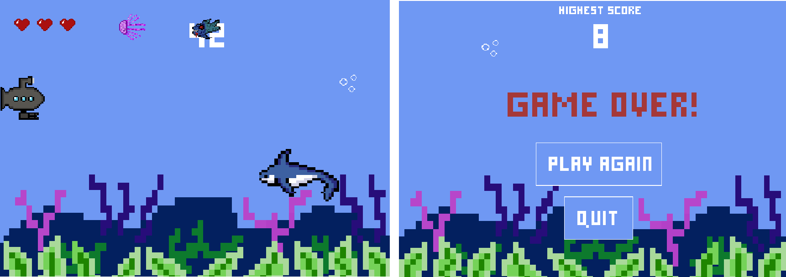
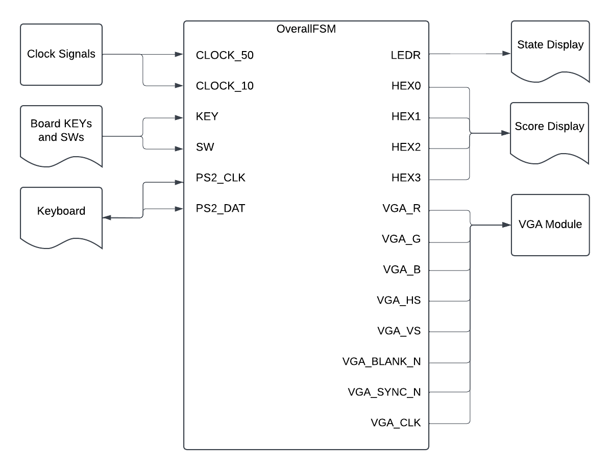
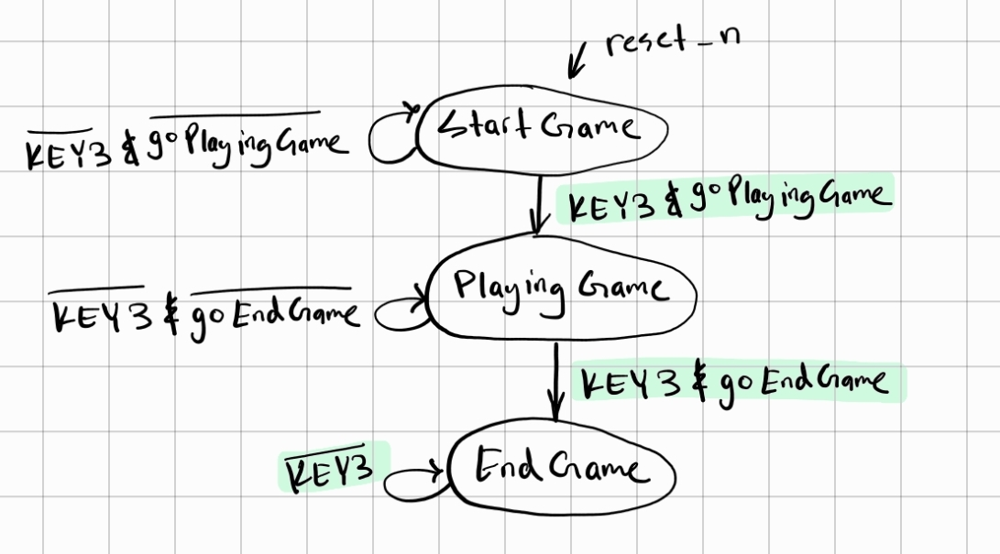
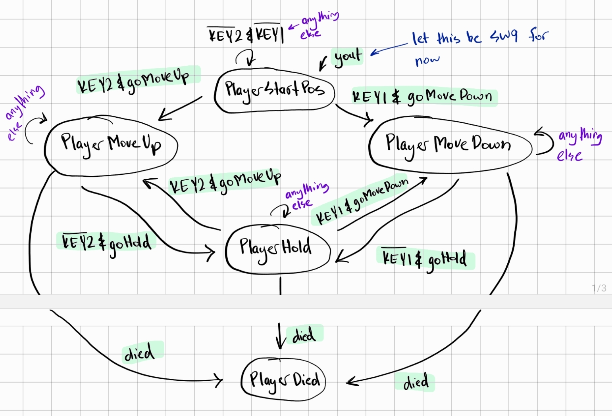
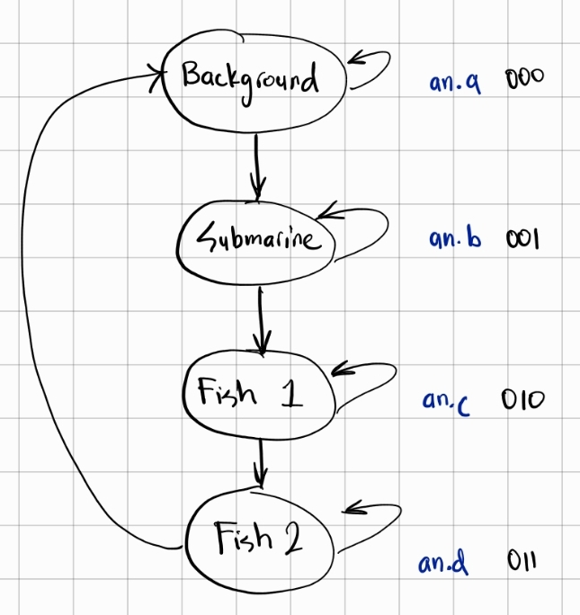
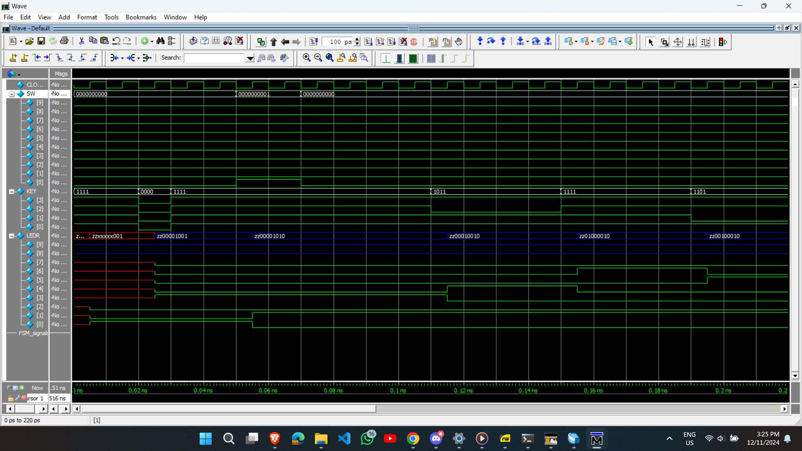
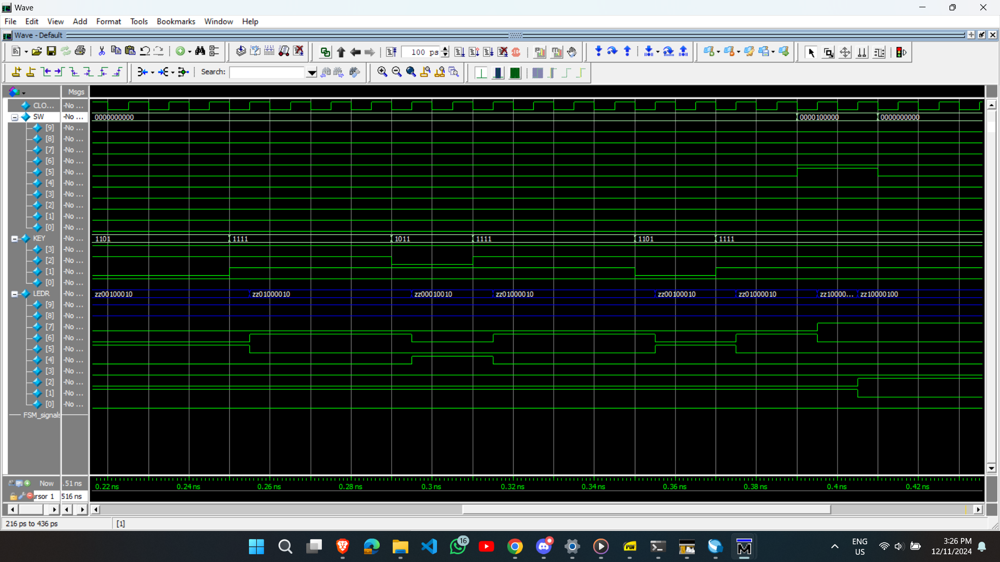

## Introduction

This project uses an FPGA board (The DE1-SoC Board) and a monitor to implement an arcade-style game called “20,000 Leagues Under the Sea”. The objective of the game is to avoid the obstacles (shark and jellyfish) for as long as possible. Hitting an obstacle will end the game. 

This project was inspired by one of the team member’s past projects. In Grade 11, Uzair Nadeem implemented a similar game using Java.

The above screenshots are from Uzair's past project. What you see below are this project's main screen and death screen. 

The original plan was to record our final presentation (which includes a live demo), but we didn't end up recording that. What I have here instead is our little demo backup video. You can view it on [YouTube at this link](https://youtu.be/ZvHXAo-glVk?si=ul_Q1MBmV4m4mS0K). Sadly, it's a bit loud (because everyone was working in the lab) and doesn't include our faces, but at least it shows the project. 

## High-level Block Diagram

The diagram below shows the high-level block diagram, highlighting the inputs and outputs. The `OverallFSM` (the name of the main module for this project), takes in clock signals, key presses, and switch signals from DE1-SoC board, as well as `inout` pins from the PS2 keyboard. The main module outputs to the LEDR’s and HEX’s on the DE1-SoC board. The VGA module outputs to a monitor. It should be noted that "FSM" in this digital systems context is an abbreviation of "finite state machine".

## Submodule Block Diagrams

This main module has several submodules that internally work together. These submodules are displayed in the figure below. The following sections have some more detailed desctiptions for major submodules, such as:
* Overall Game FSM
* Playing Game FSM
* Movement Module(s)
* Animation FSM
* Graphics Orchestration Logic 

. ")

It should be noted that because this project's timeline was three weeks long, each week served as a distinct phase. The first two weeks corresponded to Milestone 1 and Milestone 2, and the last week served as the project's culmination or capstone.

## Milestone 1
As part of Milestone 1, we have an overall FSM with three states, and one “playing game” FSM embedded inside the second state of the overall FSM. Based on KEY resets and SW inputs, we can display different backgrounds for different game states (starting, playing, ending). These modules are described in more detail below.

### Overall Game FSM

There are three overall states in the game, and they are the starting state, the playing state, and the ending state as described below:

| Starting State                                                    | Playing State                                                                  | Ending State                                  |
| ----------------------------------------------------------------- | ------------------------------------------------------------------------------ | --------------------------------------------- |
| Shall display the game’s name and interface with the user’s input | Shall take input from the user to move the submarine and animate sea creatures | Shall display “Game Over” and finish the game |

The above states can be modelled with an overall finite state machine, which will be referred to as Overall-Game FSM henceforth. After a reset signal, the game starts at the Starting Game state and stays there until an input from the user. An input signal from the user transitions the game to the Playing State, where the player plays the game. This is further expanded as another finite state machine. Once the player loses, a signal will put the game into the Ending Game state. These can be seen in more detail from the state diagram below.

### Playing Game FSM

Withing the Playing Game state from the Overall-Game FSM, there are five states. These are described more below:

* **PlayerStartPos**: Shall “spawn” the player at a predetermined position  
* **PlayerMoveUp**: Shall move the player upwards on the screen  
* **PlayerMoveDown**: Shall move the player downwards on the screen  
* **PlayerHold**: Shall keep the player at its current position  
* **PlayerDied**: Shall cause the game to exit from the Playing State  

The player will start on the left side of the screen and can provide input to either move up or down. The user’s input signal for “moving up” being high will put the game in the PlayerMoveUp state, which continuously moves the player’s submarine up. This is likewise for the PlayerMoveDown state. If the user provides no input after previously moving up or down, it puts the game in the PlayerHold state. During the game, if the signal for “died” goes high, it puts the user in the PlayerDied state, which will put the overall game into the ending game state (from the Overall-Game FSM).

## Milestone 2

With the above completed as part of the Milestone 1, we move on to Milestone 2. The following were completed as part of this second milestone:
- Designed the characters: submarine, fish, and jellyfish.
- Created modules to instantiate the characters from memory.
- Created modules to “print” the backgrounds and the characters on the monitor given a specific `x`, `y`, `pixel`, and `colour` arrays.
- Created a module to simulate the movement of the submarine through KEYs and its speed on screen (**Movement Module**).
- Created a module to simulate the movement of the fish and its speed on screen (**Movement Module**).
- Created a module to simulate the movement of the jellyfish and its speed on screen (**Movement Module**).
- Created several **counters** (half second, quarter second etc.).
- Designed an FSM (**Animation FSM**) to go through between “printing” the backgrounds and “printing” the different characters.
- Connected the **Graphics Orchestration Logic** with the **Animation FSM**.

To make it easier to describe the bold-term words, the table below explains each "function" and its implementation.

|                              | Function                                                                                                                                                                      | Implementation                                                                                                                                                                                                                                                                       |
| ---------------------------- | ----------------------------------------------------------------------------------------------------------------------------------------------------------------------------- | ------------------------------------------------------------------------------------------------------------------------------------------------------------------------------------------------------------------------------------------------------------------------------------ |
| Movement Module              | To update a character’s “coordinates” either based on input (submarine) or autonomously (fish and jellyfish) and “print” the character on the display.                        | Instantiates the character from memory, creates the specific `x`, `y`, `pixel`, and `colour` arrays, and then increments the `x` and `y` either based on input or autonomously.                                                                                                      |
| Animation FSM                | The VGA can only “print” one thing at a time. This module outputs what to print (background or sub or fish or …)                                                              | The finite state machine has as many states as there are objects to print. In our case, we have 4 objects (see the state diagram below). Clocked with one of our derived counters (the 256’th second counter in our case), the FSM outputs which object to print based on its state. |
| Graphics Orchestration Logic | Handle the output of the Animation FSM to direct the correct object to be printed to the VGA, taking into account the Playing Game state (moving up, moving down, or holding) | A combinational circuit with an `always@(*)` that checks which object is to be printed (from Animation FSM) and the current Playing Game state to direct the correct `x`, `y`, `pixel`, and `colour` arrays to the VGA module.                                                       |

Based on this FSM, our Graphics Orchestration Logic module makes it so each object "takes turns" to appear and be animated on the screen. This sequence of events can be seen with the timing diagram below. This "switching" of objects at 256 Hertz is the reason for the screen flicker that is visible during animation. 

.")

## Bugs and Issues

In a holistic view, a project is one big solution to one big problem, and that problem consists of a large number of smaller problems. As such, every step of the project is essentially a problem that needs to be fixed. While our current project is complete now that a working game is created, here were some of the major bugs and issues that we faced (and solved) throughout the project timeline.

### ⚠️ **Bug:** The Overall FSM and Playing-Game FSM sometimes directly cycled through all the states at once.
✅ **Solution:** Several “gate signals” were set so states were not traversed quickly. These “gate signals” were dependent on the current state of the game. For example, if we are in the starting screen, we do not move on to the playing screen until a signal (called `goPlayingGame` as per detailed block diagram earlier) was high. 

- Gate signals for Overall FSM: `goPlayingGame`, `goEndGame`
- Gate signals for Playing-Game FSM: `goMoveUp`, `goMoveDown`, `goHold`, `died`

### ⚠️ **Issue:** The Overall FSM and Playing-Game FSM were separate entities that needed to be integrated.
✅ **Solution:** Several “reach signals” were implemented to *reach* into each FSM’s state, permitting other modules to know which state each FSM was in. These “reach signals” controlled how the two FSM’s worked in tandem. For example, if we are in the Overall FSM’s playing state, a signal (called `goPlayingGame` as per detailed block diagram earlier) would prompt the Playing-game FSM to start up.

- Reach signals for Overall FSM: `x`, `yout`, `z`
- Reach signals for Playing-Game FSM: `a`, `b`, `c`, `d`, `e`

🖱️ **Model Sim Waveform:** As part of the solution to this problem, a Model Sim test case (specifically for Playing-Game FSM) led us to finally see evidence of our solution working. See the next section on "Simulation Waveforms".

### ⚠️ **Issue:** Animating multiple objects on the screen was not possible, since the existing implementation had only one VGA module.
✅ **Solution:** A new FSM was designed, called “Animation FSM”, would decide what object to print at what clock cycle, and it would would pass this information to the VGA module. 

🖱️ **Model Sim Waveform:** As part of the solution to this problem, a Model Sim test case for this “Animation FSM” led us to finally see evidence of our FSM properly deciding what to “print” to the screen. See the next section on "Simulation Waveforms".

### ⚠️ **Issue:** The submarine was not bounded and obstacles started on the left (which is a problem since that would terminate the game).
✅ **Solution:** After continuously testing we realized that we were bounding the submarine incorrectly and it was just a matter of changing the bounding coordinates to 7 bit number compared to 6 bit number in Verilog. For example, 6’d88 is not the same as 7’d88. From that one simple tweak we were able to bound the submarine correctly. Due to that same issue obstacles started initially from a different position compared what was wanted.

### ⚠️ **Bug:** The game was not able to reset at all
✅ **Solution:** After some testing and debugging, it was discovered that the signal to end the game was a register whose value was being updated on the rising edge of a derived clock. This derived clock reset on KEY[0], so when KEY[0] was pressed, the clock never went on a rising edge, and our ending-game signal never got reset. To fix this, we implemented two resets, a KEY[1] reset and a KEY[0] reset.

### ⚠️ **Issue:** Collision detection was not working at all
✅ **Solution:** Changed collision detection logic fully by using the pixel counter coordinates and the movement coordinates used for printing the objects and checked if they were equal in the main always block. If they are equal then we have a register that saves 1 and we send that register to the OverallFSM which will technically be our switch to go to end game.

## Simulation Waveforms

As with any complex system, there is a lot of testing required. Most of the testing was done using the FPGA hardware, but in some cases, it is necessary to use simulations to see timing waveforms. ModelSim (part of Quartus) was used to simulate these waveforms using testbench files. In the subsections below, the test cases for Playing Game FSM and Animation FSM are explained in more detail.

### Playing Game FSM Test Case

For the ModelSim, the PlayingGameFSM is instantiated and a 50MHz clock (with 10 ns period) is generated. We initialize the inputs and set switches to low. Then, we apply a reset for the keys. After that, here is the testing sequence:

- We put our FSM into the PlayingGame state by making SW[0] high
- Then we put it low again so the FSM can do its thing
- We try to move the player up for 40 ns
- We try to move the player down for 60 ns
- We try to move the player up for 20 ns
- We try to move the player down for 20 ns
- Then, we assume we hit a sea creature and died, so we put SW[5] highM
- We finish off the simulation after another 100 ns

These can be seen from the ModelSim simulation in the figures below:

### Animation FSM Test Case

In this test case, we see if the Animation FSM is properly cycling through “printing” the background, the submarine, the fish, and the jellyfish one after the other for the same duration. We are also checking if the FSM properly loops back while always keeping the “printing” of the background first. That probably won't make much sense without the ModelSim screenshots, which I have unfortunately lost... but that's okay. I think the main idea is clear: we had to do a LOT of testing. 

## Future Work

In the future, this project could be improved by:

- making the animation smoother (clocked higher)
- allowing replays without reset
- displaying the score on the display at the end of the game
- adding a “shoot” feature with elimination scores
- adding more obstacles that move in more directions

## Final Work Distribution

With a project this complex, it is important to work well with your partner. I am grateful for having Uzair Nadeem as my partner because we worked together very well and supported each other when one of us was stuck. In reality, every module was worked on by both of us, but if we had to create a "broad" work distribution, it would look as follows:

| Zaeem Ahmad                      | Uzair Nadeem                             |
| -------------------------------- | ---------------------------------------- |
| 🛠️ Overall FSM                    | 🎨 Backgrounds/character designs          |
| 🛠️ PlayingGame FSM                | 🖥️ VGA module                             |
| 🕒 Various second-enable clocks   | 🛠️ Graphics Orchestration Logic           |
| 🎨 Graphics Orchestration Logic   | 🚤 Submarine movement and display modules |
| 🎥 Animation FSM                  | 🚧 Obstacle movement and display modules  |
| ⌨️ Keyboard logic and integration | 🔍 Collision detection                    |
| 🔢 Score Counter                  |                                          |
