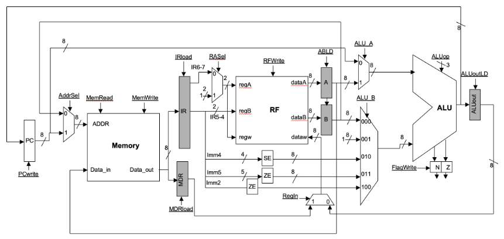
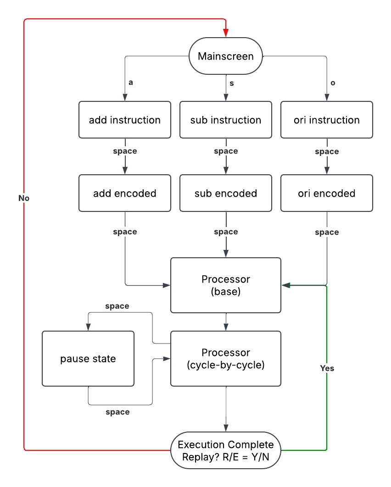
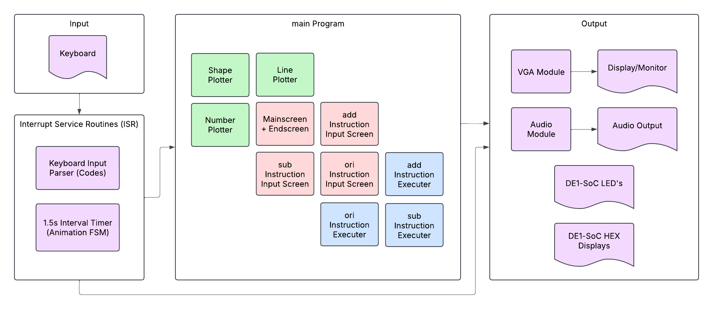

## Introduction

SimProcLator was the final project for Computer Organization (ECE243). In one sentence, this course taught us how computers operate. Building off from Digital Systems (ECE241), we learned computer organization from several abstraction levels: starting from assembly language level, then jumping up to C language level, before diving in to the digital design and operation of a simple processor. In essence, this was a course on embedded systems, because a large portion of the course was about software interacting with hardware and the real world using input/output devices.

Personally, this course was one of my favourite ones in second year because it finally answered the big question of how a computer REALLY operates. The weeks dedicated to the digital design and operation of a simple processor were perhaps my favourite. My friend and lab partner also felt the same way. For this reason, we decided to make our final project about a simple processor and how it executes instructions. In the figure below, you can see the processor we learned in class, frankly called "Simple Processor".

The Simple Processor is a tiny 8-bit processor with 4 registers, 256 bytes of memory, and 10 instructions. The digital design of this processor includes some key registers, such as the Program Counter (PC), Instruction Register (IR), and flag registers (N and Z bit). There is also an arithmetic logic unit (ALU), numerous multiplexers, and other more complex digital hardware such as memory and the register file (RF).

## What is SimProcLator?

This project, named “SimProcLator”, is exactly what it sounds like: a simple processor simulator. The name was inspired by [CPULator](https://cpulator.01xz.net/), a computer system simulator that was used extensively in this course and project. SimProcLator lets the user select one of the three currently supported instructions: 
* `add Ra, Rb`: add contents of register Ra and Rb and store the result into register Ra.
* `sub Ra, Rb`: subtract contents of register Ra and Rb and store the result into Ra.
* `ori imm5`: bit-wise logical OR the contents of register R1 (set by convention) with imm5 constant and store the result in R1.

For the `add` and `sub` instructions, SimProcLator prompts the user to select their registers `Ra` and `Rb` using the keyboard. Likewise for the `ori` instruction, the user can manually input a 5 digit binary constant `imm5`. 

Once the user inputs the information, SimProcLator moves on to an animated processor screen that shows step-by-step all the register enable-signals and MUX select bits required on each cycle of the instruction execution. 

## How to Operate SimProcLator

Before operating SimProcLator, it helps to understand the context and hardware in which it is designed to run on. The University of Toronto FPGA labs have DE1-SoC boards, which contain a large FPGA chip. Using an Intel program called Monitor Program, a **NIOS V processor** (a type of RISC V processor) is instantiated on the FPGA, and the hardware on the DE1-SoC is used to create a **NIOS V computer system** (i.e., with memory, I/O devices etc.). 

To use the NIOS V processor, one must load instructions into memory. In this course, we learned to write these instructions in either NIOS V assembly language or C. SimProcLator is written in C (source code provided on GitHub), which a user loads into the NIOS V processor using the Monitor Program.

Fortunately, you do not need a DE1-SoC to run SimProcLator because it can be run on [CPULator](https://cpulator.01xz.net/). Simply go to the website, hover over **File**, click on **open**, and choose the C file with the code. Then, press on **Compile and Load**. Once that is done (and you see the disassembly pane), click on **Continue** to run the program. You can provide keyboard input by sending letters through the **PS/2 keyboard or mouse** panel on the right (**Devices** pane; make sure to use "IRQ 22" since the NIOS V DE1-SoC has two PS/2 inputs).

The login screen lets you select an instruction to execute using the keyboard. Click “a” key for `add Ra, Rb` instruction, “s” for `sub Ra, Rb` instruction, and “o” for `ori imm5` instruction.

After that you will be greeted with a page to select registers for the add and sub instructions. Press the number on the keyboard corresponding to the register you want to select on the screen. For example, for Ra to be R3 press “3” or for Rb to be R2 press “6”. After register selection, press the “space bar”.

For all instructions, you will see the instruction encoding page. For `add` and `sub` instructions encoding will be done automatically. For the `ori` instruction, you will have to input manually an imm5 value by clicking “0” and “1” on the keyboard. Once encoding is done, you can press “space bar” to go to the processor page. 

From here it will automatically go through the process of the instruction execution while also explaining what happens when in each clock cycle. You can press “space bar” to pause and continue anywhere in between this process. 

Once instruction is done executing, a DONE sign will be shown on screen. You can press “e” to go back to the main screen to select a different instruction, or press “r” to replay the same instruction.

## SimProcLator Flowchart and Block Diagram

To understand how SimProcLator simulates the step-by-step execution of instructions, the above flowchart is quite handy. I named them to be rather self-explanatory, but for sake of completeness, here we go:
* Mainscreen: Welcome screen that lets user choose instruction to be executed by pressing one of `a`, `s`, and `o`.
* `add`/`sub` instruction: Input screen for the add/sub instructions. Lets the user pick registers Ra and Rb (one of R0 to R3).
* `ori` instruction: Input screen for the ori instruction. Closely tied with the ori encoded screen since this instruction requires an imm5 constant (SimProcLator needs to show the encoded instruction to let the user input the desired imm5 constant).
* `add`/`sub`/`ori` encoded: Shows how the assembly language instruction is encoded into binary before being placed into memory.
* Processor (base): SimProcLator draws the base processor screen. 
* Processor (cycle-by-cycle): Depending on the instruction the user selected, SimProcLator will "animate" the execution by highlighting in green the signals required during each clock cycle of instruction execution. It also highlights the important digital logic blocks in blue and red.
* Pause state: Halts the simulation when spacebar is pressed and resumes simulation when pressed again.
* Execution Complete: Indicates to the user that SimProcLator has simulated the execution of the instruction and allows either replay of the same instruction or return to Mainscreen.

The flowchart describes the way SimProcLator operates in terms of program flow and control. To better understand how SimProcLator does this under the hood, let's take a look at the block diagram below. 

We see four groups: the **Input Group**, the **Interrupt Service Routines (ISR) Group**, the **Main Program Group**, and the **Output Group**. It makes the most sense to describe the diagram by going through these four groups, but you can also appreciate the colour-coded blocks of purple, green, red, and blue. These will be mentioned at the end. 

The easiest two groups are the **Input Group** (top left) and the **Output Group** (right) because their names are self-explanatory. The only way SimProcLator accepts user input is through a keyboard, but there are quite a lot of output devices. SimProcLator makes use of a VGA module to display content on a monitor and uses an audio module to output sound through speakers. The monitor and speaker are connected to the DE1-SoC. The other two output devices—the LEDs and HEX displays—are used as testing/debugging aids and are already part of the DE1-SoC. 

The next group we look at is the **Interrupt Service Routine (ISR) Group**. Again, the name is self-evident; this group is the system's interrupt service handler. To make the system as responsive as possible in terms of keyboard input and timer output, we decided to use interrupt-based I/O synchronization instead of polling. 

A person pressing a key would trigger the keyboard ISR, within which a *keyboard input parser* would analyze the make/break codes to determine what letter was pressed and what the system should do (based on its current state). In certain states, such as *`ori` encoded* or *Processor (cycle-by-cycle)*, animating the instruction execution simulation (that's a mouthful) makes use of a 1.5 second timer. This means that every 1.5 seconds, the internal timer on the FPGA triggers an interrupt, within which our one of two massive finite state machine (FSM) checks the current program state and determines what to animate. 

This could have been done with polling, but with the size and complexity of the program, we decided to implement interrupts (which took more work, was more worth it in terms of end result—our system was a lot more responsive).

The largest group is, evidently, the **Main Program Group**, and it contains our other giant FSM. Looking at the middle of our block diagram above, we see three distinct colours: green, red, and blue. The green modules features the various "plotters" in our program, and their purpose are self-evident (i.e., shape plotter plots a shape—used for printing the processor etc.). The red modules feature the background screens at various stages of the program (i.e., mainscreen, add screen, end screen etc.). The blue modules control and write/draw on top of the red module screens. 

Everything above (this entire section, in fact), is rather a bit technical and in-depth, so don't worry if a lot of it doesn't make sense. I've written it out for anyone interested in some inner-workings and overall architecture of SimProcLator. 

## Final Work Distribution

My partner for this project was Uzair Nadeem, who was also my partner for ECE241. It was such a wonderful experience working with him because he is very reliable, trustworthy, and always finds a way to get the job done in the most excellent way possible. Also similar to ECE241, we worked together very closely on this project. However, we each worked more on certain parts of the project than others, so the table below shows roughly what each person worked on/was responsible for. Bonus: our course instructor, Professor Jonathan Rose, recorded a quick demo of our project, which you can view on [YouTube at this link](https://youtu.be/7R0thylkvb4).

| Zaeem Ahmad                                     | Uzair Nadeem                                           |
| ----------------------------------------------- | ------------------------------------------------------ |
| Interrupts for PS/2 Keyboard and Interval Timer | VGA output (display)                                   |
| Audio sample conversion and output              | ori instruction execution (timer ISR)                  |
| Overall finite state machine                    | Designing all screens (mainscreen, input screens etc.) |
| add and sub instruction execution (timer ISR)   | Plotting the processor and wires                       |
| add, sub, and ori instruction input + encoding  | Animating the clock signal                             |
